# Fiche technique — Baromètre Assurance TN

## PARTIE 1 — ARCHITECTURE GÉNÉRALE ET STACK TECHNIQUE

### Explication générale

- Décrit comment le projet est organisé sur le disque et comment une donnée voyage, du site source jusqu'à l'écran
- Sert de carte de lecture pour toutes les parties suivantes : chaque partie est un zoom sur une étape de ce flux

### Justification des outils

| Brique | Outil | Pourquoi (résumé) |
|---|---|---|
| Backend | Python + Flask | Léger, même langage que l'extraction |
| Base de données | MySQL | Données très relationnelles |
| Scraping | Selenium (CMF) + requests (reste) | Selenium seulement si JS dynamique |
| Extraction PDF | pdfplumber + Tesseract OCR | Position exacte des mots + OCR gratuit fr/ar |
| Frontend | React + Vite | Rechargement rapide en dev |
| Graphiques | ApexCharts | Beaucoup de types, peu de code |
| IA générative | Groq | Rapide, peu coûteux |
| Prévision | Prophet + XGBoost | Complémentaires, sélection auto du meilleur |
| Déploiement | Docker | Isole les services, reproductible |

**Règle générale** : l'outil le plus simple qui couvre le besoin réel, pas le plus sophistiqué.

### Schémas

### Trajet enrichi — cas particuliers du Scraping et de l'Extraction PDF

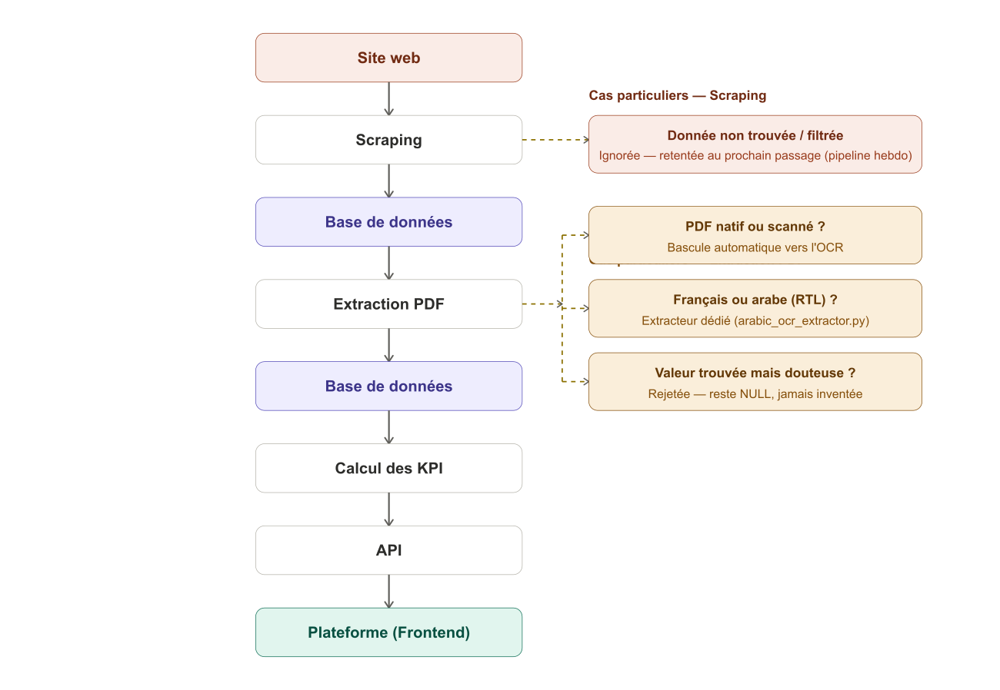

**Version interactive** (survol des étapes pour voir leurs cas particuliers, y compris Base de données et Calcul des KPI) : https://claude.ai/code/artifact/7855bd9a-5178-440c-b735-944677018ca7

---

## PARTIE 2 — SCRAPING — LA COLLECTE DES DONNÉES

### Explication générale

- Automatise la récupération des documents sur 8 sources d'origine, pour ne plus les chercher à la main
- CGA et FTUSA servent chacune 2 usages (rapports KPI + veille réglementaire), mais restent 1 source chacune
- Chaque document passe ensuite par 4 étapes communes : lecture, filtrage, déduplication, sauvegarde des métadonnées seules (jamais le PDF)

### Fichiers concernés

| Fichier | Rôle |
|---|---|
| `scraping/cmf_portal_scraper.py` | Scraper CMF (Selenium) |
| `scraping/ftusa_scraper.py` | Scraper FTUSA |
| `scraping/cga_scraper.py` | Scraper CGA (rapports KPI) |
| `scraping/bvmt_scraper.py` | Scraper BVMT |
| `scraping/ins_scraper.py` | Scraper INS |
| `api/routes/veille.py` | Atlas Magazine, IlBoursa, CGA/FTUSA réglementaire |
| `scripts/seed_enquete_marche.py` | Écrit en base les statistiques ENQUETE (dict Python déjà rempli, pas de lecture Excel) |
| `extraction/enquete_extractor.py` | Lit réellement le fichier Excel (`pandas`) — module d'extraction, pas de scraping |
| `config/company_registry.py` | Reconnaissance des sociétés (`find_code_by_name`) |
| `database/repository.py` | `document_exists`, `save_document`, `get_or_create_source` |

### Justification des outils

| Méthode | Sources | Pourquoi (résumé) |
|---|---|---|
| Selenium | CMF | Menu JS dynamique — une requête simple ne suffit pas |
| `requests` + regex | FTUSA, CGA, BVMT, INS, Atlas Magazine, IlBoursa | Pages HTML statiques, plus simple |
| Fichier local | ENQUETE | Excel fourni, pas un site web |

### Schéma général

## DÉTAIL PAR SOURCE

### CMF

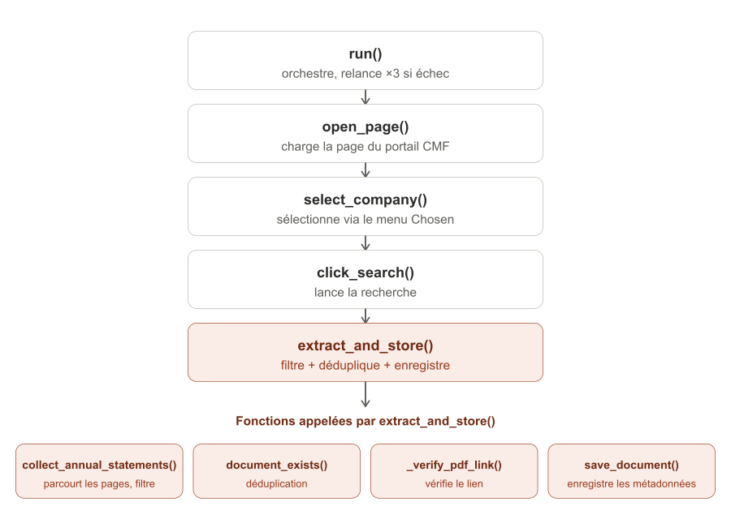

| Fonction (`scraping/cmf_portal_scraper.py`) | Rôle |
|---|---|
| `__init__` | Configure Chrome (headless), connecte la base, fixe la fenêtre 10-11 ans |
| `open_page` | Charge la page du portail CMF |
| `select_company` | Sélectionne la société (widget Chosen, repli `<select>` natif) |
| `_wait_for_filtered_options` | Attend que le menu affiche les résultats filtrés |
| `_match_option` | Trouve l'option qui correspond exactement au nom cherché |
| `click_search` | Clique sur "Rechercher", attend le rechargement de la page |
| `_parse_current_page` | Lit les lignes de résultats affichées (année, période, lien PDF) |
| `_go_to_next_page` | Passe à la page suivante des résultats, si elle existe |
| `is_annual_statement_31_12` | Vérifie qu'un document est annuel et daté du 31/12 |
| `collect_annual_statements` | Parcourt toutes les pages, applique le filtre, garde 10-11 ans |
| `_verify_pdf_link` | Vérifie que le lien PDF répond (HEAD, repli GET) |
| `extract_and_store` | Déduplique et enregistre les métadonnées en base |
| `run` | Orchestre tout le déroulé, relance ×3 en cas de timeout |
| `close` | Ferme le navigateur Chrome |

En cas d'échec à n'importe quelle étape : relance complète (×3), jamais une reprise partielle.

| Ligne(s) | Explication |
|---|---|
| 310 | Définition de la méthode, 3 tentatives par défaut |
| 311-315 | Commentaire : pourquoi on relance tout plutôt qu'une seule étape |
| 316 | Mémorise la dernière erreur rencontrée |
| 317 | Boucle sur les tentatives (1 à 3) |
| 318 | Début du bloc "essayer" |
| 319 | Ouvre la page du portail CMF |
| 320 | Sélectionne la société dans le menu |
| 321 | Clique sur le bouton de recherche |
| 322 | Si tout est OK : extrait, enregistre, et sort de la fonction |
| 323 | Intercepte une erreur de timeout |
| 324 | Mémorise cette erreur |
| 325 | Journalise la tentative échouée |
| 326-327 | Si ce n'était pas la dernière tentative, attend 2 secondes |
| 328 | Si tout a échoué, relève la dernière erreur |

---

Parmi tous les documents qu'une source propose, ne garder que ceux qui sont réellement pertinents — le critère exact dépend de la source. Exemple concret CMF :

---

Avant d'enregistrer un document, vérifier qu'il n'existe pas déjà en base (société + source + année) :

| Ligne(s) | Explication |
|---|---|
| 281 | Définition de la méthode |
| 282 | Journalise le début de l'extraction |
| 283 | Récupère la liste des états financiers annuels déjà filtrés |
| 285 | Récupère le nom exact de la société attendu par le portail |
| 286 | Récupère ou crée l'identifiant interne de la société en base |
| 288 | Compteur de documents nouvellement enregistrés |
| 289 | Boucle sur chaque année trouvée, dans l'ordre |
| 290 | Récupère le lien du PDF pour cette année |
| 291 | Vérifie si le document existe déjà en base (déduplication) |
| 292-293 | Si oui : journalise et passe à l'année suivante |
| 294 | Sinon, vérifie que le lien PDF répond bien |
| 295-296 | Si le lien est invalide : journalise et passe à l'année suivante |
| 297 | Construit le nom du fichier (société_année.pdf) |
| 298 | Enregistre les métadonnées en base (pas le PDF) |
| 299 | Incrémente le compteur |
| 300 | Journalise la confirmation |

---

### FTUSA

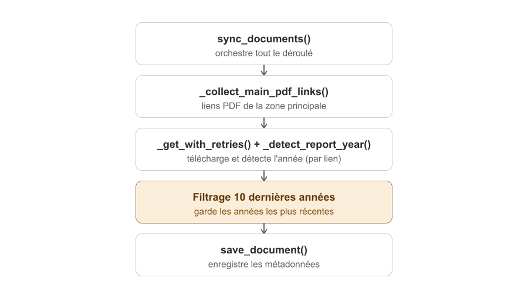

| Fonction (`scraping/ftusa_scraper.py`) | Rôle |
|---|---|
| `_get_with_retries` | Requête GET avec 3 tentatives en cas d'échec réseau |
| `_collect_main_pdf_links` | Récupère les liens PDF de la zone principale (exclut le bloc "à la une") |
| `_detect_report_year` | Lit les 2 premières pages du PDF pour trouver l'année du rapport |
| `sync_documents` | Orchestre tout : collecte, téléchargement, filtrage, enregistrement |

Pas de fonction de déduplication locale — la première URL rencontrée par année est gardée (la page liste du plus récent au plus ancien), et `save_document()` gère la déduplication côté base.

### CGA

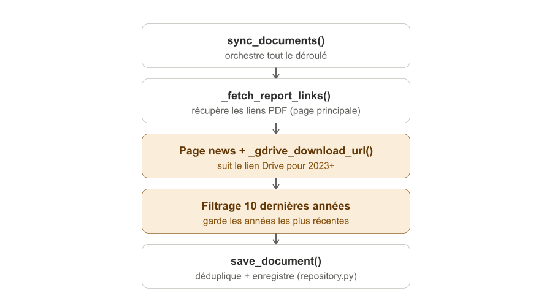

| Fonction (`scraping/cga_scraper.py`) | Rôle |
|---|---|
| `_get_with_retries` | Requête GET avec 3 tentatives |
| `_gdrive_download_url` | Construit l'URL de téléchargement direct depuis un id Google Drive |
| `_fetch_report_links` | Récupère les liens PDF (page principale + suivi de lien pour 2023+) |
| `sync_documents` | Orchestre tout : liens, filtrage, enregistrement |

### INS

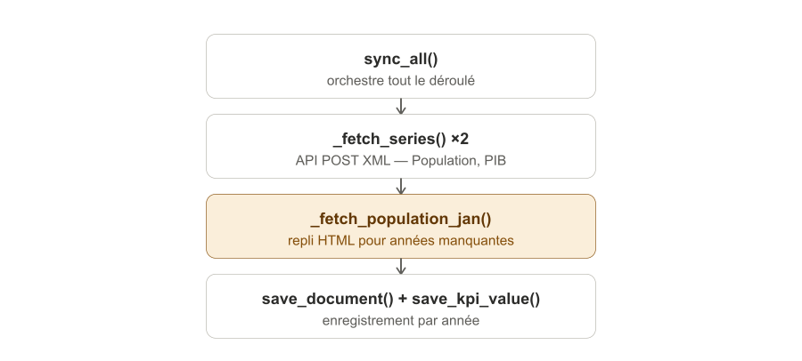

| Fonction (`scraping/ins_scraper.py`) | Rôle |
|---|---|
| `_get_with_retries` | Requête GET avec 3 tentatives |
| `_post_with_retries` | Requête POST avec 3 tentatives (appel API XML) |
| `_fetch_series` | Interroge l'API INS et parse la réponse XML |
| `_fetch_population_jan` | Repli HTML pour les années absentes de l'API |
| `sync_all` | Orchestre tout : Population, PIB, repli, enregistrement |

Pas de notion de société ni de PDF ici : chaque enregistrement est une valeur macroéconomique (Population, PIB) rattachée à une année.

### BVMT

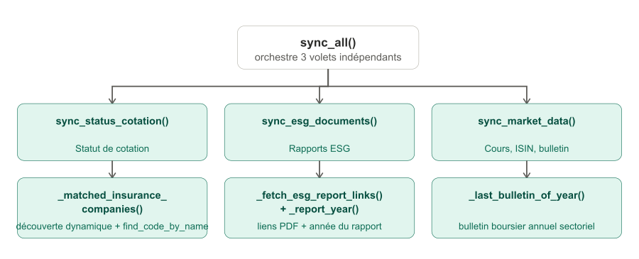

| Fonction (`scraping/bvmt_scraper.py`) | Rôle |
|---|---|
| `_get_with_retries` | Requête GET générique avec 3 tentatives |
| `_fetch_listed_insurance_companies` | Découvre les sociétés cotées du secteur Assurance |
| `_fetch_esg_societe_ids` | Récupère les identifiants de filtre ESG par société |
| `_fetch_esg_report_links` | Récupère les liens PDF des rapports ESG d'une société |
| `_report_year` | Déduit l'année d'un rapport depuis son nom de fichier |
| `_matched_insurance_companies` | Relie les sociétés BVMT au registre des sociétés (`find_code_by_name`) |
| `sync_status_cotation` | Volet 1 : enregistre le statut "Cotée" par société |
| `sync_esg_documents` | Volet 2 : enregistre les rapports ESG par société |
| `_bulletin_links_in_range` | Récupère les bulletins publiés dans une plage de dates |
| `_last_bulletin_of_year` | Trouve le dernier bulletin boursier d'une année |
| `sync_market_data` | Volet 3 : cours, ISIN, nombre d'actions, bulletin annuel |
| `sync_all` | Orchestre les 3 volets indépendants |

### ENQUETE

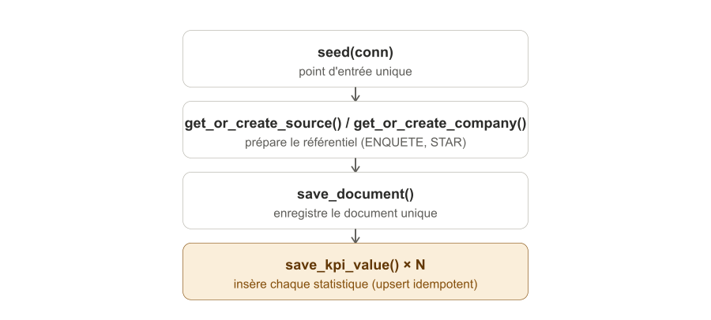

| Fonction (`scripts/seed_enquete_marche.py`) | Rôle |
|---|---|
| `seed(conn)` | Point d'entrée unique : crée le référentiel puis insère tous les KPI d'un dict Python déjà rempli |

**Correction importante** : ce script **ne lit aucun fichier Excel** — ses statistiques sont un dict Python codé en dur (`ENQUETE_DATA`), écrit une seule fois en base. La vraie lecture du fichier Excel (`Survey CX_...xlsx`, via `pandas`) se fait dans `extraction/enquete_extractor.py` (733 lignes), qui recalcule les statistiques à la volée pour l'API — un module d'extraction, pas de scraping, hors du périmètre commenté ici.

### Atlas Magazine / IlBoursa (veille)

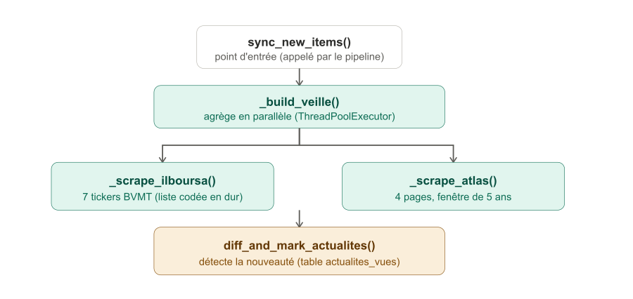

| Fonction (`api/routes/veille.py`, partie scraping) | Rôle |
|---|---|
| `_scrape_ilboursa` | Actualités liées à 7 tickers cotés BVMT (liste codée en dur) |
| `_scrape_atlas` | Actualités Tunisie sur Atlas Magazine (4 pages, fenêtre 5 ans) |
| `_scrape_cga_page` | Textes réglementaires PDF d'une rubrique du site CGA |
| `_scrape_ftusa_textes` / `_scrape_ftusa_code` | Textes législatifs et Code des assurances sur FTUSA |
| `_build_veille` | Agrège les 4 sources réglementaires en parallèle (`ThreadPoolExecutor`) |
| `sync_new_items` | Point d'entrée : re-scrape à froid + diff contre la base (appelé uniquement par le pipeline, jamais par une route HTTP) |

**Deux mécanismes distincts, à ne pas confondre** : un **cache mémoire** (`_SCRAPE_CACHE`, 1h) sert les routes HTTP live (`/api/actualites`) pour éviter de re-scraper à chaque visite ; la **détection de nouveauté** (`diff_and_mark_actualites`/`diff_and_mark_reglementation`, tables `actualites_vues`/`reglementation_vues`) sert uniquement les notifications, et re-scrape toujours à froid.

### À savoir par source

### Reconnaissance automatique des sociétés

### Cas particuliers — Scraping

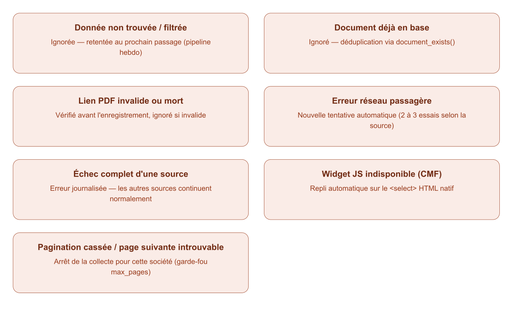

---

## PARTIE 3 — BASE DE DONNÉES

### Explication générale

- Toutes les données extraites (scraping + extraction PDF) doivent être stockées durablement, sinon il faudrait tout refaire à chaque affichage
- Sert de pivot entre toutes les couches : le scraping y écrit des métadonnées, l'extraction y écrit des chiffres, le backend y lit pour construire les pages
- MySQL, base nommée `MarketInsurance`

### Fichiers concernés

| Fichier | Rôle |
|---|---|
| `database/schema.sql` | Définition des 8 tables |
| `database/repository.py` | Toutes les fonctions d'accès (lecture, écriture, migrations) |

### Justification des outils

| Choix | Pourquoi (résumé) |
|---|---|
| MySQL | Données très relationnelles (société → document → KPI) |
| `pymysql` sans ORM | Contrôle total sur les migrations de schéma |

### Schéma des tables

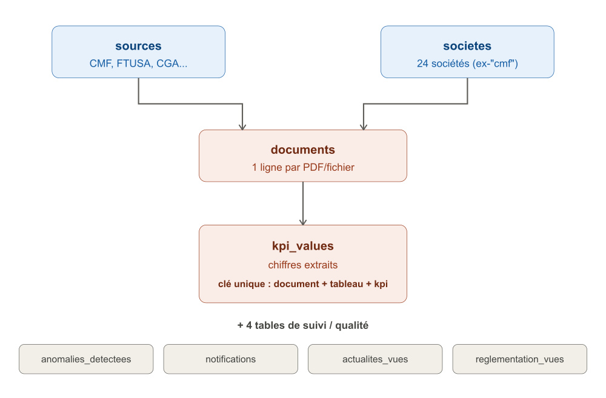

**8 tables, 3 familles** : le référentiel (`sources`, `societes`), les données collectées (`documents`, `kpi_values`), et le suivi/qualité (`anomalies_detectees`, `notifications`, `actualites_vues`, `reglementation_vues`).

### Migrations idempotentes

Le schéma peut évoluer (nouvelle colonne, nouvelle contrainte) sans jamais casser une base déjà en place. Avant chaque changement, le code vérifie l'état réel de la table via `information_schema` et n'applique le changement que s'il n'est pas déjà fait — `init_schema()` peut tourner à chaque démarrage du serveur sans risque.

### Cas particuliers — Base de données

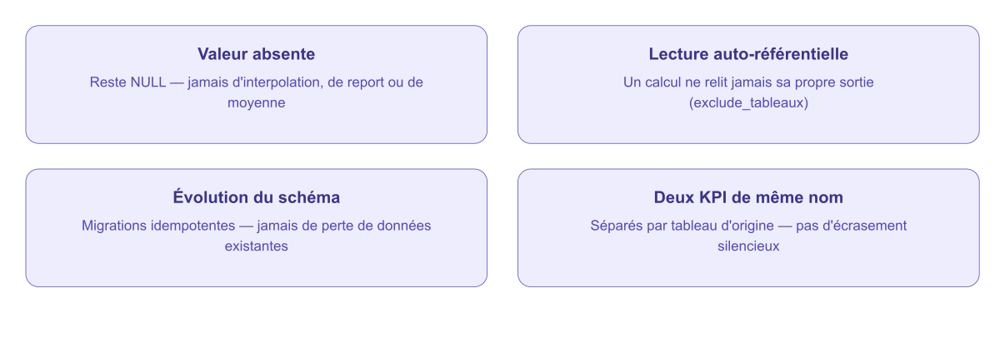

### Pourquoi 2 passages en base (exemple concret)

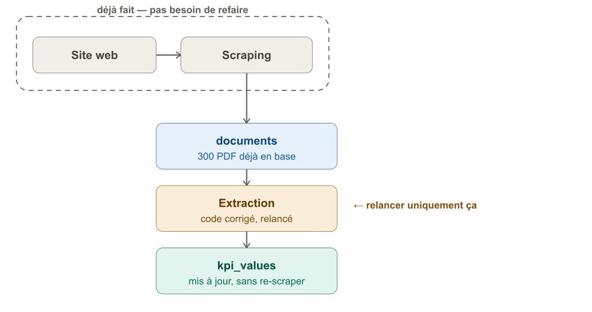

---

## PARTIE 4 — EXTRACTION PDF (aperçu)

*Partie en cours de construction — seuls les cas particuliers déjà validés sont consignés ici pour l'instant.*

### Cas particuliers — Extraction PDF

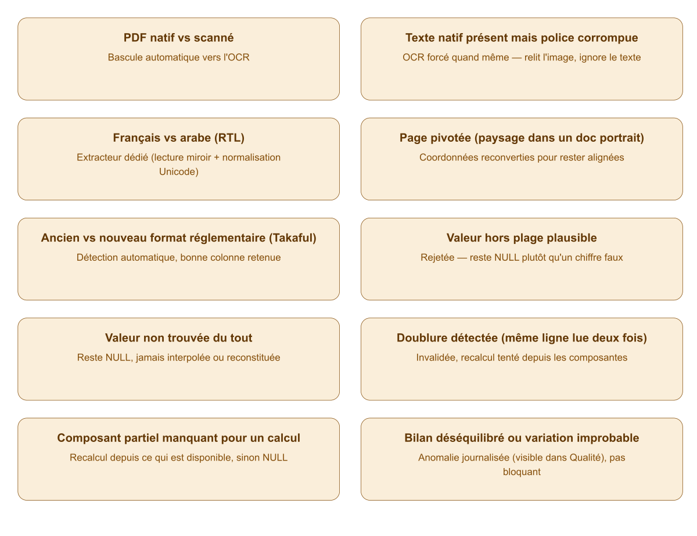
