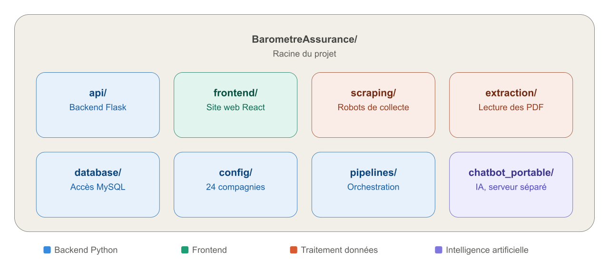
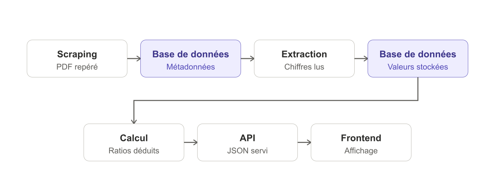
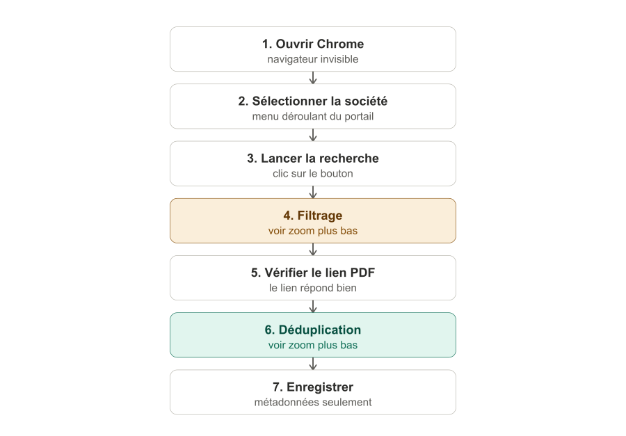
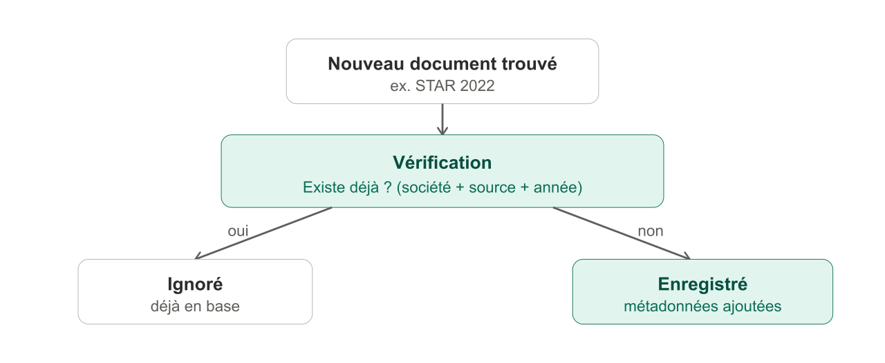
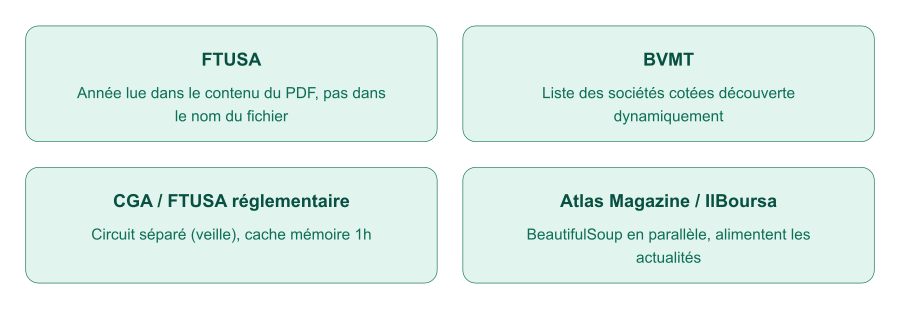
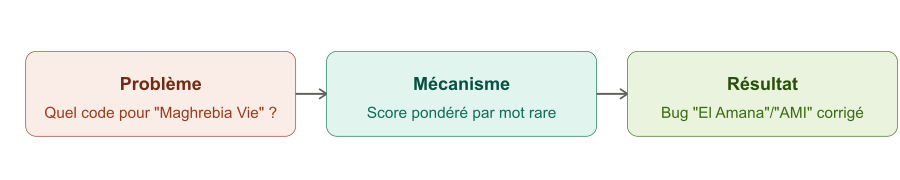

# Fiche technique — Baromètre Assurance TN

## PARTIE 1 — ARCHITECTURE GÉNÉRALE ET STACK TECHNIQUE

### Explication générale

- Décrit comment le projet est organisé sur le disque et comment une donnée voyage, du site source jusqu'à l'écran
- Sert de carte de lecture pour toutes les parties suivantes : chaque partie est un zoom sur une étape de ce flux

### Justification des outils

| Brique | Outil | Pourquoi (résumé) |
|---|---|---|
| Backend | Python + Flask | Léger, même langage que l'extraction |
| Base de données | MySQL | Données très relationnelles |
| Scraping | Selenium (CMF) + requests (reste) | Selenium seulement si JS dynamique |
| Extraction PDF | pdfplumber + Tesseract OCR | Position exacte des mots + OCR gratuit fr/ar |
| Frontend | React + Vite | Rechargement rapide en dev |
| Graphiques | ApexCharts | Beaucoup de types, peu de code |
| IA générative | Groq | Rapide, peu coûteux |
| Prévision | Prophet + XGBoost | Complémentaires, sélection auto du meilleur |
| Déploiement | Docker | Isole les services, reproductible |

**Règle générale** : l'outil le plus simple qui couvre le besoin réel, pas le plus sophistiqué.

### Schémas

---

## PARTIE 2 — SCRAPING — LA COLLECTE DES DONNÉES

### Explication générale

- Automatise la récupération des documents sur 8 sources d'origine, pour ne plus les chercher à la main
- CGA et FTUSA servent chacune 2 usages (rapports KPI + veille réglementaire), mais restent 1 source chacune
- Chaque document passe ensuite par 4 étapes communes : lecture, filtrage, déduplication, sauvegarde des métadonnées seules (jamais le PDF)

### Fichiers concernés

| Fichier | Rôle |
|---|---|
| `scraping/cmf_portal_scraper.py` | Scraper CMF (Selenium) |
| `scraping/ftusa_scraper.py` | Scraper FTUSA |
| `scraping/cga_scraper.py` | Scraper CGA (rapports KPI) |
| `scraping/bvmt_scraper.py` | Scraper BVMT |
| `scraping/ins_scraper.py` | Scraper INS |
| `api/routes/veille.py` | Atlas Magazine, IlBoursa, CGA/FTUSA réglementaire |
| `scripts/seed_enquete_marche.py` | Chargement du fichier Excel ENQUETE |
| `config/company_registry.py` | Reconnaissance des sociétés (`find_code_by_name`) |
| `database/repository.py` | `document_exists`, `save_document`, `get_or_create_source` |

### Justification des outils

| Méthode | Sources | Pourquoi (résumé) |
|---|---|---|
| Selenium | CMF | Menu JS dynamique — une requête simple ne suffit pas |
| `requests` + regex | FTUSA, CGA, BVMT, INS, Atlas Magazine, IlBoursa | Pages HTML statiques, plus simple |
| Fichier local | ENQUETE | Excel fourni, pas un site web |

### Schéma général

### Déroulé complet — cas CMF (le plus complexe, donc représentatif)

En cas d'échec à n'importe quelle étape : relance complète (×3), jamais une reprise partielle.

| Ligne(s) | Explication |
|---|---|
| 310 | Définition de la méthode, 3 tentatives par défaut |
| 311-315 | Commentaire : pourquoi on relance tout plutôt qu'une seule étape |
| 316 | Mémorise la dernière erreur rencontrée |
| 317 | Boucle sur les tentatives (1 à 3) |
| 318 | Début du bloc "essayer" |
| 319 | Ouvre la page du portail CMF |
| 320 | Sélectionne la société dans le menu |
| 321 | Clique sur le bouton de recherche |
| 322 | Si tout est OK : extrait, enregistre, et sort de la fonction |
| 323 | Intercepte une erreur de timeout |
| 324 | Mémorise cette erreur |
| 325 | Journalise la tentative échouée |
| 326-327 | Si ce n'était pas la dernière tentative, attend 2 secondes |
| 328 | Si tout a échoué, relève la dernière erreur |

---

Parmi tous les documents qu'une source propose, ne garder que ceux qui sont réellement pertinents — le critère exact dépend de la source. Exemple concret CMF :

---

Avant d'enregistrer un document, vérifier qu'il n'existe pas déjà en base (société + source + année) :

| Ligne(s) | Explication |
|---|---|
| 281 | Définition de la méthode |
| 282 | Journalise le début de l'extraction |
| 283 | Récupère la liste des états financiers annuels déjà filtrés |
| 285 | Récupère le nom exact de la société attendu par le portail |
| 286 | Récupère ou crée l'identifiant interne de la société en base |
| 288 | Compteur de documents nouvellement enregistrés |
| 289 | Boucle sur chaque année trouvée, dans l'ordre |
| 290 | Récupère le lien du PDF pour cette année |
| 291 | Vérifie si le document existe déjà en base (déduplication) |
| 292-293 | Si oui : journalise et passe à l'année suivante |
| 294 | Sinon, vérifie que le lien PDF répond bien |
| 295-296 | Si le lien est invalide : journalise et passe à l'année suivante |
| 297 | Construit le nom du fichier (société_année.pdf) |
| 298 | Enregistre les métadonnées en base (pas le PDF) |
| 299 | Incrémente le compteur |
| 300 | Journalise la confirmation |

---

### À savoir par source

### Reconnaissance automatique des sociétés

