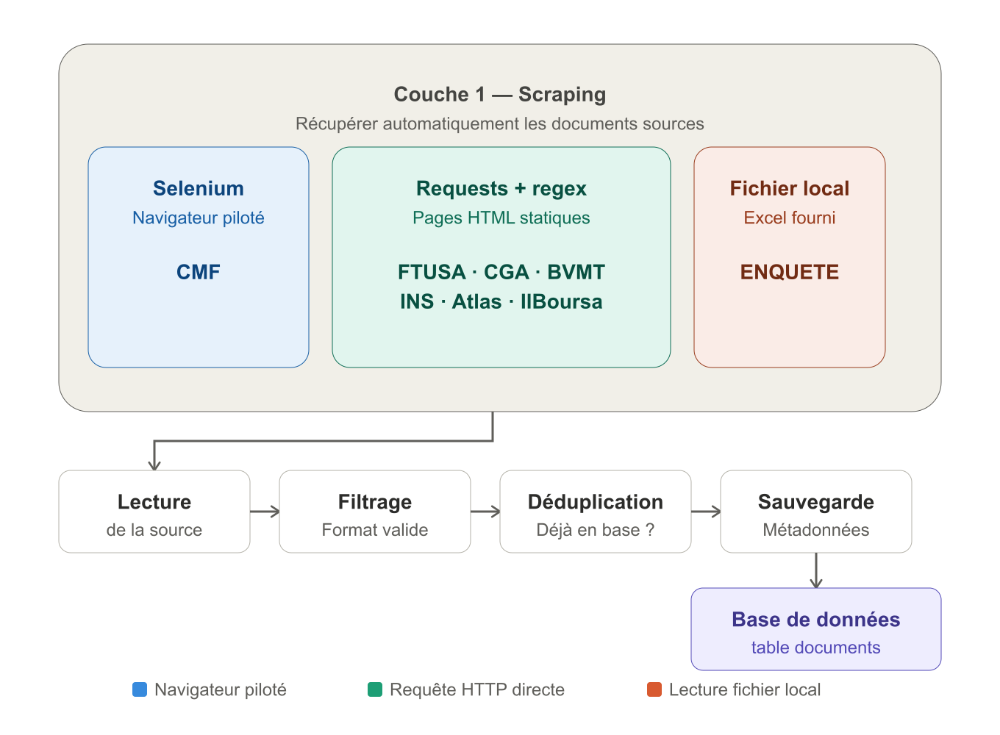
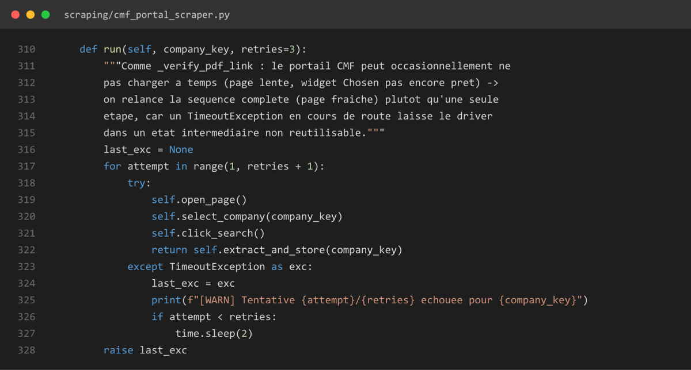
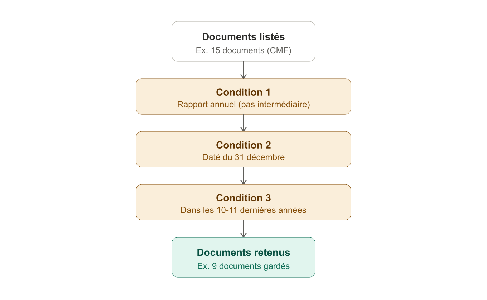
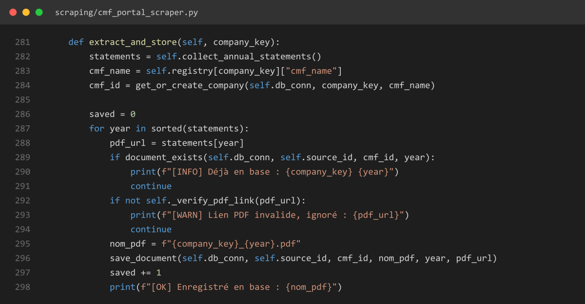

# Fiche technique — Baromètre Assurance TN / FS Market Intelligence

> Document de référence unique pour la soutenance PFE. Objectif : que n'importe qui (jury, nouveau collaborateur, vous-même dans 6 mois) puisse comprendre **quoi**, **comment** et **pourquoi** pour chaque brique de la plateforme, sans avoir à relire le code. Compilé le 2026-09-02 à partir d'une lecture exhaustive du code source (pas de reconstruction depuis la mémoire). Chemins absolus depuis `C:\Users\HP\Desktop\SCRAPING`.
>
> Ce document remplace/complète `docs/comprehension_technique_projet.md` (première version, moins complète — la répartition des sources de scraping y était sous-comptée, corrigé ici).

## Sommaire

0. [Points de vigilance avant la soutenance](#0-points-de-vigilance-avant-la-soutenance)
1. [Vision et contexte du projet](#1-vision-et-contexte-du-projet)
2. [Architecture générale et stack technique](#2-architecture-générale-et-stack-technique)
3. [Couche 1 — Collecte des données (scraping)](#3-couche-1--collecte-des-données-scraping)
4. [Couche 2 — Persistance (base de données)](#4-couche-2--persistance-base-de-données)
5. [Couche 3 — Extraction PDF](#5-couche-3--extraction-pdf)
6. [Couche 4 — Calcul des KPI et ratios](#6-couche-4--calcul-des-kpi-et-ratios)
7. [Couche 5 — Orchestration (pipeline planifié)](#7-couche-5--orchestration-pipeline-planifié)
8. [Couche 6 — Backend API](#8-couche-6--backend-api)
9. [Couche 7 — Frontend](#9-couche-7--frontend)
10. [Couche 8 — Intelligence Artificielle](#10-couche-8--intelligence-artificielle)
11. [Déploiement](#11-déploiement)
12. [Philosophie qualité et traçabilité — le fil rouge du projet](#12-philosophie-qualité-et-traçabilité--le-fil-rouge-du-projet)
13. [Tableau récapitulatif de tous les outils](#13-tableau-récapitulatif-de-tous-les-outils)
14. [Limitations connues](#14-limitations-connues)

---

## 0. Points de vigilance avant la soutenance

Écarts détectés entre les anciennes docs/README et le code réel — à corriger dans le discours :

1. **LLM = Groq, pas Claude.** Le `README.md` racine et le `docs/prompt_handoff_ia_technique.md` mentionnent une clé "Claude API" (`VITE_ANTHROPIC_KEY`). Le code réel (`chatbot_portable/app.py`) appelle exclusivement **Groq** (modèle `openai/gpt-oss-120b`). Aucune clé Anthropic nulle part dans le dépôt. Le widget Chatbot affiche lui-même "Groq LLM" dans son pied de page.
2. **Le RAG n'a pas d'embeddings** — retrieval **TF-IDF fait main**, pas de base vectorielle.
3. **"SHAP" = TreeSHAP natif XGBoost**, pas la librairie Python `shap` (absente de `requirements.txt`).
4. **8 sources d'origine, pas 5** : CMF, FTUSA, CGA, BVMT, INS, **Atlas Magazine, IlBoursa, ENQUETE**. CGA et FTUSA alimentent chacune deux circuits différents (rapports KPI dans `documents`/`kpi_values` **et** textes réglementaires dans `actualites_vues`/`reglementation_vues`, ce second circuit vivant dans `api/routes/veille.py`, pas dans `scraping/`) — mais restent une seule source d'origine chacune.
6. **README obsolète sur plusieurs points** : indique React 18 (le code utilise React 19), et une clé `VITE_ANTHROPIC_KEY` inexistante dans le code.
7. **Frontend : pages mortes/non finalisées** : `/positionnement` (stub, données codées en dur), `/geographie` (100% données mock), composants orphelins (`Sidebar.jsx`, `PageHeader.jsx`, `KpiCard.jsx`, `components/Positionnement.jsx`), pages non routées (`CarteAfrique.jsx`, `EtatGeneral.jsx`, `FicheEntreprise.jsx`).
8. **`react-simple-maps` est une dépendance installée mais inutilisée** — la carte de Tunisie est un SVG statique manipulé à la main.

**Point fort à mettre en avant** : le code contient un volume inhabituel de commentaires expliquant le "pourquoi" de chaque garde-fou avec un cas réel daté (société, année, symptôme observé, correctif). C'est la meilleure preuve de rigueur empirique à montrer au jury si on vous demande "comment avez-vous validé que c'est fiable ?".

---

## 1. Vision et contexte du projet

**Nom** : Insurance Barometer – Tunisia / "Baromètre Assurance TN" / "FS Market Intelligence" (les 3 noms désignent le même projet à différentes étapes).

**Commanditaire** : département Financial Services Transformation (FST) d'EY Tunisie — outil **interne**, pas un produit commercial.

**Cadre académique** : Projet de Fin d'Études (PFE), ESPRIT, en partenariat avec EY.

**Objectif métier** (issu du brief projet) : remplacer une analyse manuelle et fragmentée de PDF réglementaires par un outil décisionnel unique, utilisable par des compagnies d'assurance, des autorités de contrôle, des analystes financiers, des investisseurs, chercheurs et étudiants — pour :
- analyser le marché tunisien des assurances et la performance des compagnies,
- comparer plusieurs compagnies entre elles,
- calculer automatiquement ratios et indicateurs,
- détecter les anomalies,
- produire des prévisions,
- expliquer automatiquement les résultats via l'IA.

**Règle métier n°1 (la plus structurante du projet)** : il existe deux familles d'assurance totalement distinctes sur le plan comptable et réglementaire —
- **Assurance conventionnelle** (22 compagnies) : modèle classique primes/sinistres.
- **Assurance Takaful/islamique** (3 compagnies : AT_TAKAFULIA, ZITOUNA_TAKAFUL, AL_AMANAH_TAKAFUL) : modèle mutualiste (Wakala/Moudharaba, Fonds des Participants séparé de l'Opérateur, norme comptable NCT 43 différente).

Cette distinction irrigue **toute** l'architecture : extracteurs séparés, ratios séparés, filtres séparés au frontend, terminologie adaptée ("Contribution" au lieu de "Primes émises" côté Takaful).

**Périmètre couvert** : 24 compagnies d'assurance tunisiennes, 5 sources officielles (CMF, FTUSA, CGA, BVMT, INS) + enquête de marché (Excel), période **2014–2024/2025**.

---

## 2. Architecture générale et stack technique

```
BarometreAssurance/
├── api/                    Backend Flask — API REST (routes/, services/)
├── frontend/               React 19 + Vite — SPA
├── scraping/                Scrapers de collecte (5 fichiers, 6 sources)
├── extraction/              Extracteurs KPI par table PDF (par source/type)
├── config/                  Registre des 24 compagnies, config DB
├── database/                Accès MySQL (repository.py, schema.sql)
├── pipelines/                Orchestration planifiée
├── chatbot_portable/         Microservice IA (RAG + prévisions ML), séparé
├── docker-compose.yml         Déploiement 4 conteneurs
└── docs/                     Documentation
```

**Flux global de la donnée** :

```
Sites web sources (CMF, FTUSA, CGA, BVMT, INS)
        │  scraping/*.py (Selenium / requests)
        ▼
   MySQL (documents = métadonnées, PAS le PDF lui-même stocké en base)
        │  extraction/*_kpi_extractor.py (pdfplumber + OCR Tesseract)
        ▼
   MySQL (kpi_values = valeurs numériques/texte extraites)
        │  api/services/kpi_builder.py, calculated_kpi_extractor.py
        ▼
   Ratios calculés + garde-fous de plausibilité
        │  api/routes/*.py (JSON REST)
        ▼
   Frontend React (graphiques ApexCharts, tableaux, surlignage PDF)
        │
        └── chatbot_portable/ (microservice séparé, copie SQLite synchronisée)
```

### Stack technique complet

| Couche | Technologie | Version | Pourquoi ce choix |
|---|---|---|---|
| Backend | Python 3.11 / Flask 3 | `requirements-api.txt` | Framework léger, cohérent avec un backend dont la logique métier (extraction PDF, calculs) est déjà en Python pur — pas besoin d'un framework "batteries incluses" type Django pour une API interne sans admin ni auth |
| Base de données | MySQL 8 | `MarketInsurance` | Modèle **relationnel** naturel pour des données structurées (société × document × KPI), avec contraintes d'unicité utilisées comme garde-fou anti-doublon au niveau BDD (`uq_document_tableau_kpi`) |
| Accès BDD | `pymysql` (pas d'ORM) | | Accès direct pour garder un contrôle total sur les requêtes de migration idempotente (`information_schema`, jamais de `DROP TABLE`) — un ORM aurait masqué ce contrôle fin |
| Scraping | `selenium` (CMF) / `requests`+regex (FTUSA, CGA, BVMT, INS, Atlas Magazine, IlBoursa) | | Selenium réservé au **seul** cas qui l'exige réellement (widget JS dynamique du portail CMF) — `requests` partout ailleurs, plus rapide et plus simple à maintenir (détail Partie 3) |
| Extraction PDF | `pdfplumber` | ≥0.10.0 | Donne accès aux mots et à leurs coordonnées (`extract_words()`), ce qui permet de **reconstruire soi-même** les lignes/colonnes plutôt que de dépendre de `extract_tables()`, jugé peu fiable sur les PDF réels (cellules fusionnées, alignements irréguliers) |
| OCR | Tesseract (`pytesseract`) | modèles `fra`, `ara`, `eng` | Solution OCR **gratuite et locale** (pas d'appel API externe, donc pas de coût récurrent ni de dépendance réseau), avec support multilingue (français/arabe) nécessaire pour AL_AMANAH_TAKAFUL |
| Correspondance floue | `rapidfuzz` | | Implémentation C++ de la distance de Levenshtein, largement plus rapide que `difflib` natif Python — utilisé au moment de l'extraction (repli) et pour le surlignage PDF |
| Export documents | `reportlab` (PDF), `openpyxl` (Excel) | | Standards de facto en Python pour la génération programmatique de PDF/Excel |
| Frontend | React 19 + Vite | `frontend/package.json` | Vite pour un HMR rapide en développement ; React pour son écosystème de composants et sa compatibilité avec `react-router-dom` v7 (SPA multi-pages) |
| Graphiques | ApexCharts / `react-apexcharts` | | Large palette de types de graphiques (line/bar/donut/area/scatter) avec une API déclarative simple, pas besoin de manipuler le DOM SVG à la main comme avec D3 |
| Rendu PDF frontend | `pdfjs-dist` | | Bibliothèque officielle Mozilla pour le rendu PDF côté navigateur — seule option mature pour afficher un PDF avec un système de coordonnées exploitable (nécessaire pour le surlignage) |
| Design | EY Design System | Barlow, `#FFE600`, `#2E2E38` | Charte graphique imposée par le commanditaire (identité visuelle EY) |
| Prévision ML | Prophet + XGBoost | `chatbot_portable/requirements.txt` | Deux familles de modèles complémentaires : Prophet excelle sur les séries à tendance structurelle longue (primes, PIB), XGBoost sur les séries plus volatiles à base de features (ratios) — la sélection automatique choisit le meilleur par cross-validation plutôt que d'imposer un choix a priori |
| LLM | Groq (`openai/gpt-oss-120b`) | `groq>=0.9.0` | Inference rapide et peu coûteuse par rapport aux API LLM propriétaires classiques — suffisant pour un usage de reformulation/synthèse contrainte par un contexte factuel fourni (pas de génération libre) |
| Déploiement | Docker Compose (4 services) | `docker-compose.yml` | Isolation des 3 runtimes différents (MySQL, API Python, microservice IA Python séparé, frontend statique) avec un seul point d'orchestration |

**Sécurité** : aucune authentification sur l'API (`CORS` ouvert sans restriction d'origine) — cohérent avec un usage **interne**, réseau non exposé publiquement. Seule clé secrète en jeu : `GROQ_API_KEY`, jamais exposée au frontend.

---

## 3. Couche 1 — Collecte des données (scraping)

**8 sources d'origine.** Deux d'entre elles (CGA et FTUSA) alimentent chacune deux circuits différents dans l'application — des rapports chiffrés (KPI) *et* des textes réglementaires — mais restent une seule source d'origine chacune.



Trois méthodes techniques différentes selon la nature du site, et une chaîne commune de 4 étapes une fois la donnée récupérée :

| Méthode | Sources concernées | Pourquoi ce choix |
|---|---|---|
| **Selenium** (navigateur piloté, invisible) | CMF uniquement | Le sélecteur de société sur ce portail est un widget JavaScript dynamique (plugin "Chosen" Drupal) — une simple requête HTTP ne peut pas interagir avec un composant rendu côté client. Repli sur le `<select>` HTML natif si le widget n'a pas chargé. |
| **`requests` + regex** (requête HTTP directe) | FTUSA, CGA, BVMT, INS, Atlas Magazine, IlBoursa | Pages HTML majoritairement statiques — plus simple, plus rapide et plus robuste que d'ouvrir un navigateur complet pour une page qui ne le nécessite pas. |
| **Lecture de fichier local** | ENQUETE | Ce n'est pas un site web : les données viennent d'un fichier Excel (`Survey CX_...xlsx`) fourni directement — pas de scraping à proprement parler. |

**Le déroulé concret pour CMF** (le scraper le plus complexe, donc le plus représentatif) : ouverture d'un Chrome invisible → sélection de la société dans le menu déroulant → lancement de la recherche → **filtrage** (voir ci-dessous) → vérification que le lien du PDF répond → **déduplication** (voir ci-dessous) → enregistrement en base des métadonnées seulement (jamais le PDF lui-même, il sera re-téléchargé à la demande). En cas d'échec en cours de route, le programme relance tout depuis le début (jusqu'à 3 fois) plutôt que de reprendre au milieu — un plantage en cours de route laisse le navigateur dans un état difficile à récupérer proprement.

**Extrait de code réel — `scraping/cmf_portal_scraper.py`, méthode `run()` (lignes 310-328)** : c'est exactement ce mécanisme de nouvelle tentative complète, pas juste de l'étape en échec.



**Filtrage** : parmi tous les documents qu'une source propose, ne garder que ceux qui sont réellement pertinents. Le critère exact dépend de la source — exemple concret pour CMF ci-dessous.



**Déduplication** : avant d'enregistrer un document, le programme vérifie dans la base de données si un document identique (même société, même source, même année) existe déjà. Si oui, rien n'est fait ; si non, il est enregistré. Ça évite qu'un même rapport soit dupliqué en base à chaque passage du scraper.

**Extrait de code réel — `scraping/cmf_portal_scraper.py`, méthode `extract_and_store()` (lignes 281-298)** : `document_exists()` (ligne 289) est l'appel qui fait exactement cette vérification ; `save_document()` (ligne 296) n'enregistre que le nom, l'année et le lien — jamais le fichier PDF.



**Résilience réseau** : tous les scrapers `requests` partagent un mécanisme de nouvelle tentative (3 essais, pause de 1,5 seconde entre chaque) car les sites cibles répondent parfois par un simple délai d'attente dépassé sans raison particulière.

**Détails propres à certaines sources** :
- **FTUSA** : l'année d'un rapport est détectée en lisant le **contenu** du PDF plutôt que son nom de fichier — jugé trop peu fiable sur 25 ans d'archives (ex. fichiers nommés `Rapport-FTUSA-DEFINITIF.pdf`).
- **BVMT** : la liste des sociétés cotées en bourse est découverte dynamiquement plutôt que codée en dur — évite une maintenance manuelle si une société entre ou sort de la cote.
- **CGA / FTUSA (réglementaire)** : ce deuxième circuit (lois, décrets, circulaires côté CGA ; codes professionnels côté FTUSA) alimente la page "Veille réglementaire", avec un cache mémoire (1h) et une détection de nouveauté propre (`actualites_vues`/`reglementation_vues`), indépendante des tables `documents`/`kpi_values` utilisées par le reste du pipeline.
- **Atlas Magazine / IlBoursa** : scraping via BeautifulSoup, exécuté en parallèle (`ThreadPoolExecutor`) pour aller plus vite ; alimentent la page Actualités, pas les KPI.

### Reconnaissance automatique des sociétés — `config/company_registry.py`

Problème concret : quand un scraper lit un nom sur un site (ex. "Assurances Maghrebia Vie"), comment reconnaître automatiquement qu'il s'agit du code interne `MAGHREBIA_VIE` et pas de `MAGHREBIA` (la maison-mère) ?

`COMPANY_REGISTRY` (24 sociétés, `{cmf_name, aliases}`) + `find_code_by_name()` : rapprochement par **similarité de Jaccard pondérée** — chaque mot d'un alias est pondéré par l'inverse du nombre de sociétés qui le partagent. Un mot générique comme "ASSURANCES" (présent dans presque tous les noms) compte très peu ; un mot rare et distinctif comme "VIE" ou "MAGHREBIA" compte beaucoup plus. Sans cette pondération, deux sociétés au nom proche obtiendraient un score de correspondance quasi identique face à un même texte source.

Bug réel corrigé grâce à cette pondération : "El Amana Takaful" était mal reconnu et confondu avec la société "AMI" (dont un alias est "El Ittihad") — les deux ne partageaient que le mot "EL", bien trop générique pour être un indice de correspondance fiable.

---

## 4. Couche 2 — Persistance (base de données)

**MySQL 8**, base `MarketInsurance`, 6 tables (`database/schema.sql`), accès via `pymysql` sans ORM (`database/repository.py`).

| Table | Rôle | Point clé |
|---|---|---|
| `sources` | CMF/FTUSA/CGA/INS/BVMT/ENQUETE | Créée dynamiquement (`get_or_create_source`) |
| `cmf` | Référentiel des 24 sociétés | Nom historique (hérité de l'époque "CMF only") |
| `documents` | 1 ligne par PDF/fichier collecté | `cmf_id` **nullable** pour les documents sectoriels (FTUSA/CGA/INS n'ont pas de société associée) ; clé unique `(source_id, cmf_id, annee)` |
| `kpi_values` | Valeurs extraites | Clé unique `(document_id, tableau, kpi)` — **`tableau` fait partie de la clé** pour qu'un même nom de KPI produit par deux tableaux différents (ex. Bilan vs Calcul interne) ne s'écrase jamais silencieusement |
| `anomalies_detectees` | Anomalies + historique du score qualité | Table à double usage : anomalies ponctuelles ET instantanés de tendance qualité |
| `notifications` | Cloche in-app | Types : nouveau_document, anomalie_critique, echec_pipeline, nouvelle_actualite, nouvelle_reglementation |
| `actualites_vues` / `reglementation_vues` | Déduplication veille | Clé = URL/identifiant, garde "premier passage" anti-avalanche |

**Pourquoi MySQL plutôt que PostgreSQL/SQLite** : volume modéré (~300 documents, ~14 000 valeurs de KPI) ne justifiant pas les fonctionnalités avancées de Postgres ; MySQL reste un choix standard, bien supporté par `pymysql`, et suffisant pour ce volume avec de simples index/contraintes uniques.

**Migrations idempotentes** (`init_schema()`, appelée à chaque démarrage de l'API) : basées sur `information_schema`/`SHOW INDEX`, jamais de `DROP TABLE` — permet de faire évoluer le schéma sans script de migration séparé à exécuter manuellement. Un vrai bug de production (juillet 2026) a été corrigé ici : une migration devait retirer une clé étrangère **avant** de supprimer l'ancien index unique qui la supportait (erreur MySQL "Cannot drop index ... needed in a foreign key constraint").

**Principe non négociable, répété dans tout le code** : *aucune valeur manquante n'est jamais reconstituée* — pas d'interpolation, pas de report d'année précédente, pas de moyenne sectorielle. Un KPI absent reste `NULL` jusqu'au frontend, qui affiche "N/D".

---

## 5. Couche 3 — Extraction PDF

**C'est le cœur technique et le plus différenciant du projet** : transformer des PDF hétérogènes (natifs propres, scannés, pivotés, corrompus, en arabe) en valeurs numériques fiables.

### 5.1 Principe fondateur et choix d'outil

**Choix : ne jamais utiliser `pdfplumber.extract_tables()`.** Jugé peu fiable sur les PDF réels (cellules fusionnées, alignements variables selon la société). À la place, reconstruction manuelle des lignes/colonnes à partir de `page.extract_words()` (mots + coordonnées x/y) :
- `_cluster_lines()` regroupe les mots dont le `top` diffère de moins de 5pt → lignes visuelles.
- `_extract_numeric_clusters()` regroupe les tokens numériques consécutifs (écart <4pt) → colonnes.

**Règle d'or** : "aucune donnée plutôt qu'une donnée fausse" — chaque extracteur applique des garde-fous de plausibilité (bornes min/max) plutôt que de faire confiance aveuglément à l'OCR.

### 5.2 Bascule texte natif ↔ OCR — `_OcrFallbackPage`

Enveloppe transparente autour d'une page pdfplumber, qui décide **dynamiquement par page** :
- Texte natif si présent et suffisamment long (seuil 20 caractères).
- Sinon, bascule OCR.
- Un mode `force=True` (2ᵉ passe, seulement si un KPI-clé manque encore) **impose l'OCR même si du texte natif existe** — nécessaire pour le cas d'une page dont le texte est vectoriel mais l'**encodage de police corrompu** (ex. BH 2020 : "3992 196 2r9o 892 rSol 3o4" — assez long pour passer le seuil de 20 caractères, mais inexploitable numériquement).

**Pourquoi Tesseract et pas une API OCR cloud (Google Vision, AWS Textract, etc.)** : solution locale, gratuite, sans dépendance réseau ni coût récurrent, avec les modèles linguistiques requis (français + arabe) disponibles nativement.

**Paramétrage OCR** : résolution **300 dpi**, `--psm 6` ("bloc de texte uniforme") — le mode par défaut (`psm 3`) fusionnait des mots adjacents sur les tableaux denses (constaté sur STAR 2025), cassant la reconnaissance du libellé.

### 5.3 Extracteurs spécialisés par tableau (`extraction/`)

| Extracteur | Tableau source | Particularité |
|---|---|---|
| `bilan_kpi_extractor.py` | Bilan Actif/Passif | Repérage par codes réglementaires du plan comptable tunisien (AC1-AC7/PA1-PA7) comme ancres fiables |
| `annexe12_kpi_extractor.py` / `annexe13_kpi_extractor.py` | Résultat technique Vie / Non-Vie | Bug corrigé (2026-08-17) : sur pages à 4 colonnes, la dernière colonne est l'année **précédente**, pas courante |
| `resultat_kpi_extractor.py` | État de résultat | Désambiguïsation Vie/Non-Vie par **code de ligne** (CHV/CHNV) plutôt que titre de page (5 formulations différentes selon la société) |
| `cga_kpi_extractor.py` | Rapport CGA | Gère du texte tourné à 90° via une matrice de police (pas l'attribut `/Rotate`) |
| `calculated_kpi_extractor.py` | — (calcul, pas extraction) | Ratios dérivés depuis les valeurs déjà en base |
| `takaful_kpi_extractor.py` | Bilan Takaful (FR + AR) | Détection automatique format "ancien"/"nouveau" (NCT 43) ; extracteur arabe séparé |
| `arabic_ocr_extractor.py` | AL_AMANAH_TAKAFUL (arabe) | Lecture RTL, normalisation Unicode NFKC, repli OCR bilingue arabe→anglais pour les chiffres |
| `enquete_extractor.py` | Excel enquête | Lecture pandas, pas de PDF |

**Pourquoi `rapidfuzz` pour la correspondance floue** : un libellé peut être légèrement dégradé par l'OCR (ex. "Chargesd'acqusion gestonnetes" au lieu de "Charges d'acquisition et de gestion nettes"). `rapidfuzz.fuzz.ratio` (implémentation C++, rapide) calcule un score de similarité, avec un seuil strict (**82%**) pour ne pas accrocher une ligne voisine par erreur.

### 5.4 Surlignage PDF — `api/services/pdf_cell_coords.py`

Ne calcule pas de valeur : localise, pour un (ligne, colonne) déjà connu, la **bbox** de la cellule dans le PDF, pour dessiner un rectangle de surlignage côté frontend. **4 passes de correspondance successives** (sous-chaîne exacte → mot-par-mot → titres repliés sur 2 lignes → correspondance floue), avec exclusion systématique des lignes de titre de page (`_TITLE_ROW_RE`) qui contiennent presque toujours le nom du KPI cherché — faux positif systémique découvert sur STAR 2025.

**Rotation de page** : pdfplumber travaille en coordonnées visuelles post-rotation, pdf.js (frontend) attend des coordonnées natives pré-rotation — `_rotate_to_native()` fait la conversion. Vérifié en simulant la vraie séquence `getViewport()`/`convertToViewportPoint()` en Node.js avec `pdfjs-dist`, pas seulement supposé en Python.

### 5.5 Documentation empirique — `extraction/CAS_PARTICULIERS*.md`

11 fichiers, ~1080 lignes, structurés en tableaux "Cas résolus"/"Cas non résolus" par société/année, avec la méthode de vérification systématiquement documentée. C'est la trace écrite de la méthode empirique du projet : *ouvrir le vrai PDF avant de coder un motif, jamais deviner*.

---

## 6. Couche 4 — Calcul des KPI et ratios

`extraction/calculated_kpi_extractor.py` (calcul en base, à partir de valeurs déjà extraites) + `api/services/kpi_builder.py` (calcul/repli à la lecture, pour l'affichage).

**Formules principales** :
- ROA (%) = Résultat Net / Total actif × 100
- ROE (%) = Résultat Net / Capitaux propres × 100
- Ratio de sinistralité RSP (%) = |Charges de prestations| / Primes émises × 100
- Ratio de frais RF (%) = |Charges d'acquisition et de gestion| / Primes émises × 100
- Ratio combiné RC (%) = RSP + RF
- Part de marché (%) = Primes société / Total primes sectoriel (FTUSA) × 100
- Taux de pénétration = Primes totales / PIB × 100 ; Densité = Primes totales / Population

**Pourquoi un double niveau de calcul (écriture ET lecture)** : à l'écriture (`calculated_kpi_extractor.py`), les ratios sont calculés une fois et persistés, avec un garde-fou de plausibilité (2%-1000%). À la lecture (`kpi_builder.py`), une chaîne de repli recalcule un ratio manquant depuis les composantes brutes si besoin — pour que deux pages différentes de l'application (Analyse Comparative, Vue par Assurance) n'affichent jamais deux valeurs différentes pour le même KPI (bug réel corrigé le 2026-08-17).

**Garde-fous notables** : détection de "doublure" (RC≈RF à moins de 0,5 point → probablement la même ligne PDF lue deux fois), `segment_mismatch` (numérateur et dénominateur d'un ratio doivent couvrir le même segment Vie/Non-Vie — bug réel trouvé sur BIAT), identité comptable Total actif ≥ Capitaux propres.

---

## 7. Couche 5 — Orchestration (pipeline planifié)

`pipelines/run_pipeline.py` :
- Exécute les 5 sources de scraping avec **retry 3 tentatives, backoff exponentiel 2/4/8s** — une source en échec n'interrompt pas les autres.
- Calcule et **persiste un instantané** du score qualité (historique de tendance).
- Détecte les nouveautés de veille (actualités/réglementation).
- Génère un rapport HTML par exécution + notifications in-app.
- Webhook Slack optionnel en cas d'échec.

**Déclenchement** : Windows Task Scheduler, hebdomadaire (dimanche 2h).

**Problème réel et solution retenue** : la tâche planifiée s'est révélée peu fiable (mode "Interactive uniquement", jamais exécutée en pratique faute de session active). **Solution** : `check_and_notify_veille()` — version allégée du pipeline (juste la veille) exécutée par un **thread de fond dans le process Flask lui-même** (`_start_veille_watcher`), toutes les 30 minutes, démarré automatiquement au chargement de l'API. La tâche planifiée Windows reste utilisée uniquement pour la collecte CMF complète (plus lourde, moins critique en fraîcheur).

**Pourquoi cette solution plutôt qu'un vrai scheduler externe (Celery, cron Linux, etc.)** : contrainte d'environnement (déploiement local Windows, pas de serveur Linux dédié) — un thread de fond dans le process applicatif déjà actif est la solution la plus simple et robuste dans ce contexte, sans infrastructure supplémentaire.

---

## 8. Couche 6 — Backend API

`api/app.py` (point d'entrée) + 8 blueprints (`api/routes/`) + services métier (`api/services/`).

**Inventaire des endpoints par domaine** :

| Blueprint | Rôle |
|---|---|
| `apercu_marche` | Données macro sectorielles (profil pays, évolution primes, distribution géographique des agences) |
| `comparative` | Benchmarking inter-compagnies |
| `vue_assurance` | Fiche détaillée par compagnie |
| `enquete` | Données d'enquête de marché (Excel) |
| `veille` | Actualités + réglementation (scraping live, cache 1h) |
| `qualite` | Qualité des données, traçabilité PDF (surlignage), rapport IA |
| `export` | Génération PDF/Excel |
| `notifications` | Cloche in-app |

**Services clés** : `kpi_builder.py` (construction des lignes KPI avec repli), `quality.py` (score qualité, `PROBLEMATIC_CODES`), `anomalies_service.py` (détection d'anomalies + rapport IA avec garde-fou anti-hallucination), `pipeline_audit.py` (diagnostic de cause), `pdf_export.py`/`excel_export.py` (exports — réutilisent directement les fonctions-vues Flask existantes pour ne jamais dupliquer une règle métier).

**Pourquoi pas d'authentification** : usage strictement interne (réseau EY), pas d'exposition publique prévue — un choix pragmatique pour un PFE/outil interne, à documenter comme limite assumée si le sujet est déployé plus largement.

**`use_reloader=False`** : le rechargeur automatique Flask casse la connexion MySQL au redémarrage sur cette machine Windows (cause exacte non identifiée, 100% reproductible) → toute modification backend nécessite un redémarrage manuel.

---

## 9. Couche 7 — Frontend

React 19 + Vite, `react-router-dom` v7, ApexCharts, `pdfjs-dist`. **13 pages routées**, dont 3 non liées dans la navbar (`/positionnement`, `/kpi-detail`, `/rapport-pipeline` — accès direct par URL).

**Pourquoi React + Vite plutôt qu'un autre framework** : écosystème mature pour une SPA avec beaucoup d'état d'interface (filtres, sélecteurs), Vite offrant un cycle de développement rapide (HMR) adapté à des itérations fréquentes sur les pages de visualisation.

**Pourquoi ApexCharts plutôt que D3/Chart.js/Recharts** : API déclarative haut niveau couvrant tous les types de graphiques nécessaires (line/bar/donut/area/scatter) sans avoir à manipuler le rendu SVG bas niveau — accélère le développement au prix d'une personnalisation plus limitée que D3.

**Mécanisme le plus complexe du frontend : `KpiDetail.jsx` (zoom + surlignage PDF)**
- Rendu PDF via `pdfjs-dist`, deux canvas superposés (rendu + overlay de surlignage transparent aux clics).
- Cache du document parsé — seul un changement de société/année reparse le PDF ; zoom/page ne fait que recalculer le viewport.
- Conversion de coordonnées via l'API native pdf.js `convertToViewportPoint()`, qui gère automatiquement échelle et rotation — pas de logique de conversion manuelle côté frontend.
- 3 endpoints selon le contexte : `pdf-cell-coords` (société standard), `sector-pdf-cell` (FTUSA/CGA), `arabic-pdf-cell` (AL_AMANAH_TAKAFUL).

**Design system EY** : palette `#FFE600` (jaune)/`#2E2E38` (anthracite), police Barlow — imposée par la charte EY, mais redéfinie manuellement dans une dizaine de fichiers plutôt que centralisée dans un thème unique (point d'amélioration possible, pas bloquant).

**Chatbot** : composant flottant global, communique avec un **backend séparé** (port 5001, distinct de l'API principale port 8002) — voir §10.

---

## 10. Couche 8 — Intelligence Artificielle

Microservice Flask **indépendant** (`chatbot_portable/`, port 5001), avec sa propre copie SQLite synchronisée manuellement depuis MySQL (portabilité Docker sans dépendance MySQL directe pour ce composant).

### 10.1 Chatbot RAG (réglementaire)

- **Retrieval** : TF-IDF **fait main** (`_tokenize()`, `_tfidf_score()` — calcul `tf×idf` codé directement, pas de scikit-learn) sur un corpus hybride : 12 fiches réglementaires rédigées à la main + corpus "extra" ingéré automatiquement depuis les rapports CGA (`rag_ingest.py`, pipeline batch manuel, filtrage anti-corruption OCR, chunking par paragraphes).
- **Pourquoi pas d'embeddings/base vectorielle** : corpus de taille modeste (une douzaine de fiches + quelques dizaines de pages ingérées), pour lequel un TF-IDF simple est suffisant et évite la complexité/coût d'une infrastructure vectorielle (modèle d'embedding à héberger ou appeler, index à maintenir) disproportionnée à l'échelle du corpus.
- **Génération** : Groq, prompt système strict ("réponds uniquement à partir des documents fournis"), fallback sans LLM = renvoi direct du contexte brut si l'appel échoue (réponse toujours produite).

### 10.2 Module de prévision (`prediction/`)

Architecture Factory/Strategy, point d'entrée `ForecastService.predict()`.

**Sélection automatique Prophet vs XGBoost** : véritable AutoML léger par **cross-validation chronologique combinée** (TimeSeriesSplit + Walk-Forward), score composite `MAPE×0.7 + (RMSE/MAE)×0.3`, le plus bas gagne. Une préférence a priori par nature de KPI (Prophet pour séries à tendance structurelle comme les primes, XGBoost pour ratios volatils comme le ROE) détermine seulement l'**ordre de test**, pas le résultat final — le score décide.

**Explicabilité** :
- XGBoost → **TreeSHAP natif** (`booster.predict(dmat, pred_contribs=True)`, intégré à la librairie XGBoost elle-même, pas la lib Python `shap`).
- Prophet → décomposition trend (poids 0.6) / saisonnalité (0.2) / momentum récent (0.2).

**Pourquoi Prophet + XGBoost plutôt qu'un seul modèle** : les séries KPI de ce projet sont **courtes** (5 à 15 points annuels) et de nature hétérogène — certaines à tendance longue et lissée (démographiques/macro), d'autres bruitées et sensibles à des facteurs récents (ratios techniques). Un seul modèle universel aurait sous-performé sur l'une des deux catégories ; la sélection automatique par CV évite d'avoir à trancher manuellement par KPI.

**Narratif automatique** : génère un texte structuré à partir des résultats déjà calculés (aucun calcul dans ce module), passé au LLM Groq pour reformulation finale — avec un prompt anti-hallucination renforcé après un incident réel (2026-08-18) où le LLM inventait des événements fictifs (fusion de compagnies, cadre réglementaire inexistant).

**Fallback complet** : si `prediction/` échoue, bascule sur une régression linéaire OLS simple, explicitement étiquetée comme telle dans la réponse.

### 10.3 Synchronisation `sync_db.py`

Reconstruction **complète** (DELETE + ré-INSERT intégral) de la copie SQLite depuis MySQL — pas de diff incrémental, jugé disproportionné pour ce volume. **Déclenchement entièrement manuel**, aucun scheduler ne l'appelle (contrairement à la veille) — un incident réel de dérive (copie vieille d'un mois faussant les prévisions) est documenté directement dans le code.

---

## 11. Déploiement

`docker-compose.yml` — 4 services :

| Service | Image/Build | Port | Rôle |
|---|---|---|---|
| `mysql` | `mysql:8.0` | 3306 | Base de données, schéma initialisé automatiquement (`schema.sql` monté en `docker-entrypoint-initdb.d`) |
| `api` | `Dockerfile.api` | 8002 | Backend Flask principal |
| `chatbot` | `chatbot_portable/Dockerfile` | 5001 | Microservice IA (Gunicorn, 2 workers, timeout 300s) |
| `frontend` | `frontend/Dockerfile` | 5173→80 | Build statique servi (Nginx probable derrière le port 80) |

**Pourquoi Docker Compose plutôt qu'un déploiement manuel** : isole 3 runtimes différents (MySQL, 2 services Python distincts, un frontend statique) avec un seul point d'orchestration et une reproductibilité de l'environnement — pertinent pour une démonstration ou un déploiement au-delà du poste de développement Windows local.

---

## 12. Philosophie qualité et traçabilité — le fil rouge du projet

Ce qui distingue ce projet d'un simple pipeline d'extraction : **chaque chiffre affiché est traçable jusqu'à sa cellule source**, et **aucune incertitude n'est masquée**.

- **"Aucune donnée plutôt qu'une donnée fausse"** — répété dans tout le code, appliqué à chaque étape (extraction, calcul, affichage).
- **Système de qualité des données** (`/qualite-donnees`) : matrice Compagnie × KPI, statut par cellule (Extrait/Calculé/Non extrait/Non calculé/Aberrant).
- **Système d'anomalies** (`/anomalies-systeme`) : 9 types classés par gravité et par étape du pipeline (Scraping → Extraction → Transformation → Validation → Cohérence), avec un rapport IA généré à la demande et vérifié par un **garde-fou anti-hallucination explicite** (`_check_grounding` : rejette toute réponse du LLM citant un chiffre non présent dans les faits fournis).
- **Audit pipeline** (`/rapport-pipeline`) : diagnostique la **cause probable** de chaque KPI manquant/aberrant sans re-scanner les PDF (6 étapes de diagnostic).
- **Traçabilité PDF** (`/kpi-detail`) : chaque KPI affiché peut être localisé et surligné directement dans son document source, quel que soit le format (natif, scanné, pivoté, arabe).
- **`extraction/CAS_PARTICULIERS*.md`** : chaque cas résolu et chaque limite non résolue est documenté avec société/année/explication — méthode reproductible pour tout nouveau cas futur.

---

## 13. Tableau récapitulatif de tous les outils

| Domaine | Outil | Rôle précis |
|---|---|---|
| Backend | Flask 3, flask-cors | API REST, gestion CORS |
| BDD | MySQL 8, `pymysql` | Persistance relationnelle, accès direct sans ORM |
| Scraping | `selenium` | Interaction avec le widget JS dynamique du portail CMF |
| Scraping | `requests`, `beautifulsoup4` | Scraping HTML statique (FTUSA/CGA/BVMT/INS + veille) |
| Extraction PDF | `pdfplumber` | Extraction de mots + coordonnées (pas `extract_tables()`) |
| OCR | `pytesseract` (Tesseract), modèles `fra`/`ara`/`eng` | Lecture des pages scannées ou à police corrompue |
| Correspondance | `rapidfuzz` | Correspondance floue (libellés dégradés par l'OCR) |
| Export | `reportlab`, `openpyxl` | Génération PDF / Excel |
| Serveur prod | `gunicorn` | Serveur WSGI pour le déploiement Docker |
| Frontend | React 19, Vite, `react-router-dom` v7 | SPA, routage |
| Graphiques | ApexCharts (`react-apexcharts`) | Visualisation de données |
| PDF frontend | `pdfjs-dist` | Rendu PDF + surlignage dans le navigateur |
| Style | Tailwind CSS (partiel), styles inline | Mise en forme (design system EY dupliqué manuellement) |
| Markdown | `react-markdown`, `remark-gfm` | Rendu du rapport IA |
| ML — prévision | `prophet`, `xgboost` | Modèles de séries temporelles, sélectionnés automatiquement |
| ML — RAG | TF-IDF fait main (pas de librairie dédiée) | Recherche documentaire réglementaire |
| LLM | `groq` (modèle `openai/gpt-oss-120b`) | Génération de texte (RAG, narratif prévision, explications, rapport IA) |
| Déploiement | Docker, Docker Compose | Orchestration multi-conteneurs |

---

## 14. Limitations connues

| Domaine | Limitation | Statut |
|---|---|---|
| Bilan | COTUNACE : OCR corrompu à la source | Non résolu, société exclue de l'affichage |
| Bilan | BH 2020 : Total actif introuvable (image trop dégradée) | Non résolu |
| Annexe 12/13 | COMAR 2018 : PDF entièrement scanné, 0 caractère sur 45 pages | Non résolu |
| Annexe 13 | STAR 2025 : 2 lignes introuvables même à 400 dpi | Non résolu, documenté |
| Résultat | TUNIS_RE 2024 : séparateur de milliers scindant un nombre en 2 tokens | Cause identifiée, correctif non appliqué (portée jugée trop large) |
| Takaful | AL_AMANAH_TAKAFUL : Surplus Familial/Général incomplet (5/9 exercices) | Non résolu |
| Takaful | Commissions Wakala/Moudharaba | Jamais câblées (signe incohérent en test) |
| ML | Copie SQLite du chatbot peut dériver silencieusement (sync manuelle) | Pas de garde-fou automatique |
| Frontend | `/positionnement`, `/geographie` non fonctionnels/mock | À finaliser ou retirer avant la soutenance |
| Sécurité | Pas d'authentification sur l'API | Acceptable pour un usage interne, à noter comme limite si extension du périmètre |
| Traçabilité | Priorisation des sociétés à approfondir pour l'audit `/kpi-detail` | Jamais tranchée |

---

*Document compilé à partir d'une exploration systématique du code (5 agents dédiés : scraping/BDD/pipeline, extraction PDF, backend API, frontend, IA/ML) + lecture directe de `requirements.txt`, `package.json`, `docker-compose.yml`, `README.md` et `docs/pfe_phase_documentation.md`.*
