# Résumé fonctions — Trajet de la donnée

> **Logique de ce document** : au lieu de lister les fonctions fichier par
> fichier, on suit **une donnée réelle** (un état financier annuel d'une
> société) tout au long de son trajet, fonction par fonction, **dans l'ordre
> réel d'exécution** — depuis le moment où elle est scrapée sur le portail
> CMF jusqu'au moment où elle est écrite en base MySQL. Chaque étape montre
> la capture d'écran réelle du code, une explication ligne par ligne, et une
> phrase "Utilité". On s'arrête **avant l'extraction** (le calcul des KPI à
> partir des PDF stockés est une phase séparée, documentée plus tard).
>
> **Pilote de cette logique : la source CMF** (`scraping/cmf_portal_scraper.py`),
> car c'est la source la plus complète (14 fonctions, toutes les étapes du
> trajet y sont visibles). Une fois cette partie validée, le même principe
> sera appliqué aux 7 autres sources (FTUSA, CGA, BVMT, INS, ENQUETE, Atlas
> Magazine, IlBoursa).

---

## Vue d'ensemble du trajet (source CMF)

```
__init__()                    -> ouvre Chrome + la base, fixe la fenêtre d'années
   |
run()                         -> orchestre tout, relance ×3 si timeout
   |
   ├─ open_page()              -> charge la page du portail CMF
   |
   ├─ select_company()         -> sélectionne la société dans le menu
   |     ├─ _wait_for_filtered_options()
   |     └─ _match_option()
   |
   ├─ click_search()           -> lance la recherche
   |
   └─ extract_and_store()      -> filtre, déduplique, enregistre
         ├─ collect_annual_statements()
         |     ├─ _parse_current_page()
         |     ├─ is_annual_statement_31_12()
         |     └─ _go_to_next_page()
         ├─ _verify_pdf_link()
         └─ save_document()    -> ★ ÉCRITURE EN BASE (fin du trajet ici)

close()                       -> ferme Chrome + la base (après toutes les sociétés)
```

---

## Étape 1 — `__init__()` — mise en place

**Rôle dans le trajet** : premier appel, avant toute donnée. Configure le
navigateur Chrome piloté, ouvre la connexion à la base, et calcule la
fenêtre des 10-11 dernières années à conserver.

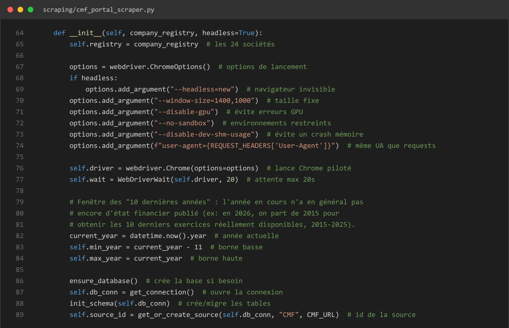

| Ligne(s) | Explication |
|---|---|
| 64 | Définition, reçoit le registre des sociétés et un mode headless |
| 65 | Stocke le registre des 24 sociétés |
| 67 | Crée les options de lancement de Chrome |
| 68-69 | Mode headless (navigateur invisible) si demandé |
| 70 | Fixe une taille de fenêtre |
| 71-73 | Options de stabilité (GPU, sandbox, mémoire) |
| 74 | Utilise le même User-Agent que les requêtes HTTP directes |
| 76 | Lance Chrome avec ces options |
| 77 | Attente maximale de 20s pour les éléments de la page |
| 79-81 | Commentaire : pourquoi une fenêtre de "10 dernières années" |
| 82-84 | Calcule les bornes basse et haute de la fenêtre d'années |
| 86-88 | Crée la base si besoin, ouvre la connexion, crée/migre les tables |
| 89 | Récupère (ou crée) l'id de la source "CMF" |

**Utilité** : point de départ du trajet — sans cette étape, aucune page ne peut être chargée ni aucune donnée enregistrée.

---

## Étape 2 — `run()` — orchestrateur

**Rôle dans le trajet** : appelé une fois par société à traiter ; enchaîne
les 4 étapes suivantes dans l'ordre, et relance toute la séquence (page
fraîche) jusqu'à 3 fois en cas de timeout.


| Ligne(s) | Explication |
|---|---|
| 329 | Définition de la méthode, 3 tentatives par défaut |
| 330-334 | Commentaire : pourquoi on relance tout plutôt qu'une seule étape |
| 335 | Mémorise la dernière erreur rencontrée |
| 336 | Boucle sur les tentatives (1 à 3) |
| 337 | Début du bloc "essayer" |
| 338 | Ouvre la page du portail CMF |
| 339 | Sélectionne la société dans le menu |
| 340 | Clique sur le bouton de recherche |
| 341 | Si tout est OK : extrait, enregistre, et sort de la fonction |
| 342 | Intercepte une erreur de timeout |
| 343 | Mémorise cette erreur |
| 344 | Journalise la tentative échouée |
| 345-346 | Si ce n'était pas la dernière tentative, attend 2 secondes |
| 347 | Si tout a échoué, relève la dernière erreur |

**Utilité** : garantit qu'un incident réseau ponctuel (page lente, widget pas encore prêt) ne fait pas perdre toute une société — on repart de zéro plutôt que de continuer dans un état incohérent.

---

## Étape 3 — `open_page()` — chargement de la page

**Rôle dans le trajet** : premier appel fait par `run()`. Charge la page du portail CMF où se trouve le menu de sélection des sociétés.

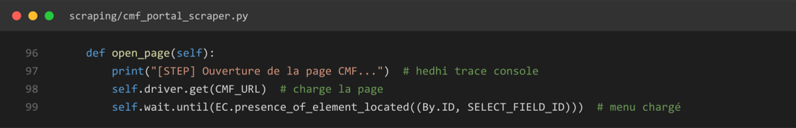

| Ligne(s) | Explication |
|---|---|
| 96 | Définition de la méthode |
| 97 | Trace console |
| 98 | Charge l'URL du portail CMF |
| 99 | Attend que le menu de sélection soit chargé |

**Utilité** : sans page chargée, aucun menu n'est disponible pour l'étape suivante.

---

## Étape 4 — `select_company()` — sélection de la société

**Rôle dans le trajet** : appelée par `run()` juste après `open_page()`. Sélectionne la société voulue dans le menu déroulant (widget JS "Chosen", avec repli sur le `<select>` HTML natif si le widget ne charge pas).

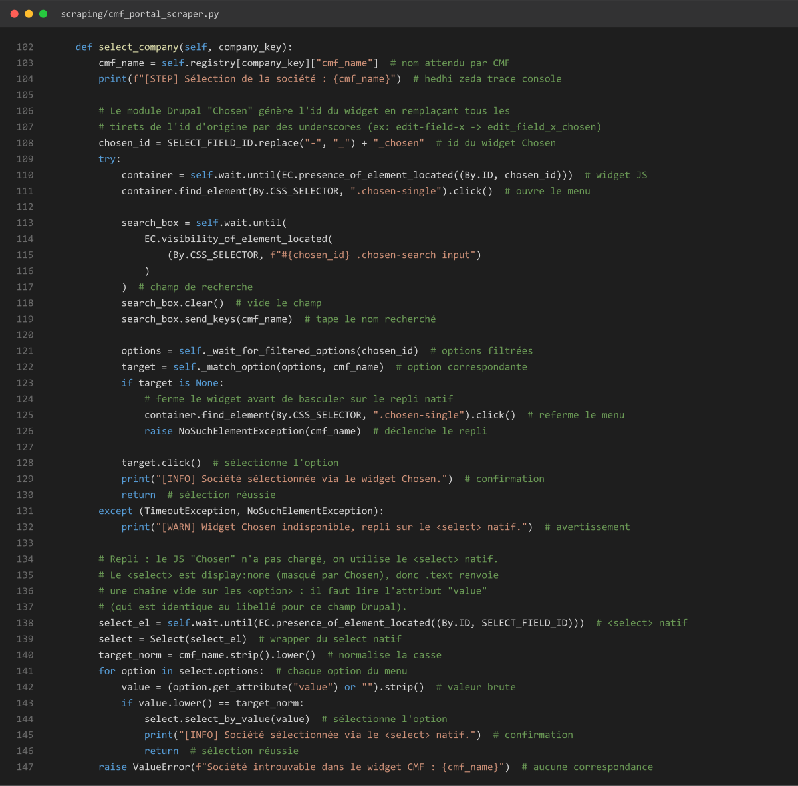

| Ligne(s) | Explication |
|---|---|
| 102-104 | Définition, récupère le nom exact attendu par le portail, trace console |
| 106-108 | Commentaire + construction de l'id du widget Chosen |
| 109-111 | Attend le widget, clique pour ouvrir le menu déroulant |
| 113-119 | Attend le champ de recherche, le vide, tape le nom de la société |
| 121-122 | Récupère les options filtrées, cherche celle qui correspond |
| 123-126 | Si aucune correspondance : referme le menu, déclenche le repli |
| 128-130 | Sinon : clique sur l'option, confirme, sort de la fonction |
| 131-132 | Si le widget a timeout : avertissement, passe au repli natif |
| 134-137 | Commentaire : pourquoi le repli lit l'attribut "value" |
| 138-140 | Attend le `<select>` natif, prépare le wrapper Selenium |
| 141-146 | Boucle sur les options natives ; si une correspond : sélectionne et sort |
| 147 | Si rien ne correspond nulle part : lève une erreur explicite |

**Utilité** : identifie précisément quelle société consulter — une erreur ici ferait extraire les données de la mauvaise société.

### → Sous-fonction appelée : `_wait_for_filtered_options()`

**Rôle dans le trajet** : appelée par `select_company()` (ligne 121) juste après avoir tapé le nom recherché — attend que le widget affiche les résultats filtrés.

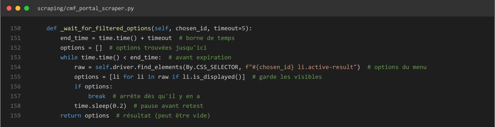

| Ligne(s) | Explication |
|---|---|
| 150 | Définition, timeout par défaut 5s |
| 151-152 | Calcule l'heure limite, initialise la liste des options |
| 153-155 | Tant que le délai n'est pas dépassé : cherche les options actives visibles |
| 156-157 | Dès qu'il y en a, arrête la boucle |
| 158 | Sinon, petite pause avant de retester |
| 159 | Renvoie les options trouvées (éventuellement vide) |

**Utilité** : le filtrage du menu par JavaScript prend un instant — sans cette attente active, la liste lue serait vide ou incomplète.

### → Sous-fonction appelée : `_match_option()`

**Rôle dans le trajet** : appelée par `select_company()` (ligne 122) juste après — trouve, parmi les options filtrées, celle qui correspond au nom cherché.

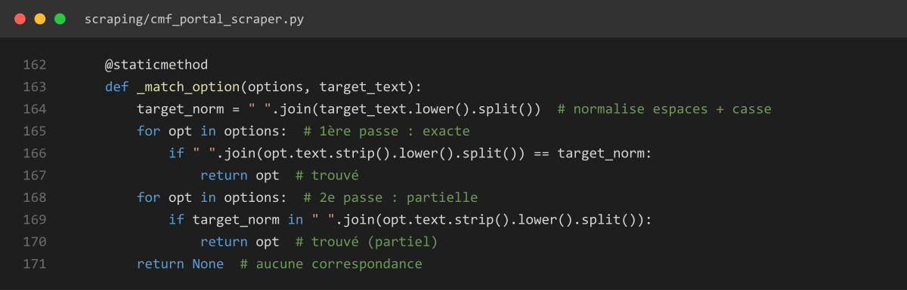

| Ligne(s) | Explication |
|---|---|
| 162-163 | Méthode statique, reçoit les options et le nom cherché |
| 164 | Normalise espaces et casse du nom cherché |
| 165-167 | 1ère passe : cherche une correspondance exacte |
| 168-170 | 2e passe (repli) : cherche une correspondance partielle |
| 171 | Aucune correspondance trouvée |

**Utilité** : tolère de petites différences de formatage (espaces, casse) entre le nom du registre et le texte affiché sur le site, sans jamais matcher au hasard.

---

## Étape 5 — `click_search()` — lancement de la recherche

**Rôle dans le trajet** : appelée par `run()` juste après `select_company()`. Clique sur "Rechercher" et attend que la page se recharge avec les résultats.

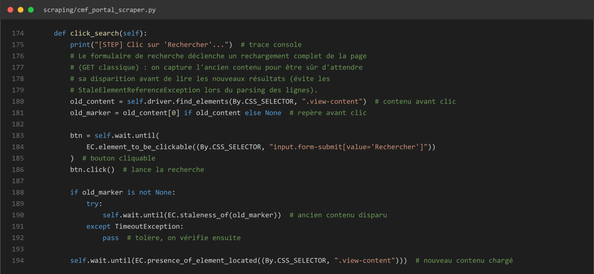

| Ligne(s) | Explication |
|---|---|
| 174-175 | Définition, trace console |
| 176-179 | Commentaire : pourquoi capturer l'ancien contenu avant de cliquer |
| 180-181 | Repère l'ancien bloc de résultats (avant clic) |
| 183-186 | Attend que le bouton "Rechercher" soit cliquable, clique dessus |
| 188-192 | Attend que l'ancien contenu disparaisse (tolère un timeout) |
| 194 | Attend que le nouveau contenu soit chargé |

**Utilité** : garantit qu'on lit les nouveaux résultats et non un résidu de l'ancienne page (source d'erreurs `StaleElementReferenceException` si on ne l'attend pas).

---

## Étape 6 — `extract_and_store()` — filtrage, déduplication, enregistrement

**Rôle dans le trajet** : appelée par `run()` en dernier — c'est elle qui orchestre la fin du trajet (collecte → vérification → écriture en base). Ci-dessous les 3 sous-fonctions qu'elle appelle, dans l'ordre.


| Ligne(s) | Explication |
|---|---|
| 299 | Définition de la méthode |
| 300 | Journalise le début de l'extraction |
| 301 | Récupère la liste des états financiers annuels déjà filtrés |
| 303-304 | Récupère le nom de la société et son id interne en base |
| 306 | Compteur de documents nouvellement enregistrés |
| 307-308 | Boucle sur chaque année trouvée, dans l'ordre |
| 309 | Vérifie si le document existe déjà en base (déduplication) |
| 310-311 | Si oui : journalise et passe à l'année suivante |
| 312 | Sinon, vérifie que le lien PDF répond bien |
| 313-314 | Si le lien est invalide : journalise et passe à l'année suivante |
| 315-316 | Construit le nom du fichier, enregistre les métadonnées en base |
| 317-318 | Incrémente le compteur, journalise la confirmation |

**Utilité** : c'est la fonction qui décide, pour chaque année collectée, si la donnée doit réellement être écrite en base (pas déjà présente, lien PDF valide).

### → Sous-fonction appelée en premier : `collect_annual_statements()`

**Rôle dans le trajet** : appelée par `extract_and_store()` (ligne 301), avant toute vérification — parcourt toutes les pages de résultats et applique le filtre "annuel au 31/12, 10-11 dernières années".

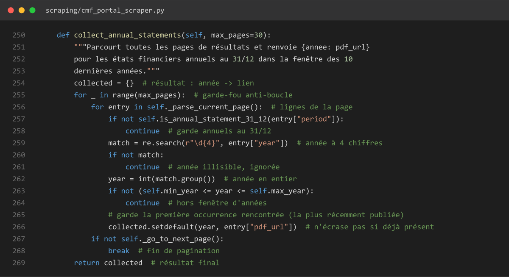

| Ligne(s) | Explication |
|---|---|
| 250-253 | Définition (limite 30 pages), docstring |
| 254 | Résultat : dictionnaire année -> lien |
| 255-256 | Boucle sur les pages, puis sur les lignes de la page courante |
| 257-258 | Ne garde que les documents annuels au 31/12 |
| 259-261 | Extrait l'année (4 chiffres) ; si illisible, ignorée |
| 262-264 | Convertit en entier ; si hors fenêtre des 10-11 ans, ignorée |
| 265-266 | Garde la 1ère occurrence rencontrée pour cette année |
| 267-268 | Passe à la page suivante, sinon arrête |
| 269 | Renvoie le résultat final |

**Utilité** : c'est le vrai point de filtrage de la donnée — parmi tous les documents listés sur le site (annuels, intermédiaires, toutes années), ne garde que ceux qui nous intéressent.

#### → Sous-fonction appelée dans la boucle : `_parse_current_page()`

**Rôle dans le trajet** : appelée par `collect_annual_statements()` (ligne 256) à chaque page — lit les lignes de résultats actuellement affichées.

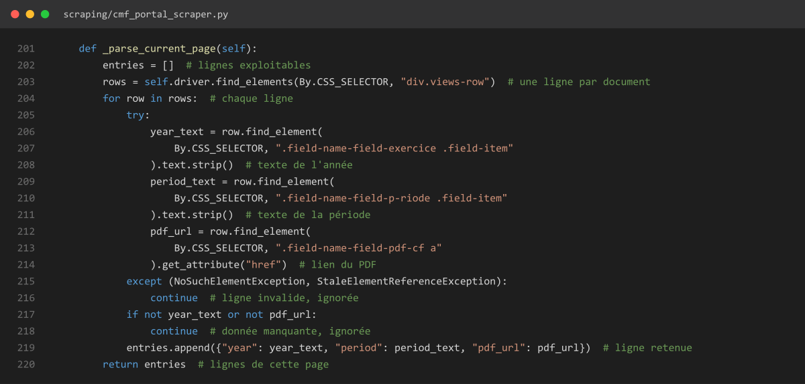

| Ligne(s) | Explication |
|---|---|
| 201-203 | Définition, liste vide, récupère toutes les lignes de résultats |
| 204 | Boucle sur chaque ligne |
| 206-214 | Récupère le texte de l'année, de la période, et le lien du PDF |
| 215-216 | Si un élément attendu manque : ligne ignorée |
| 217-218 | Si année ou lien manquant : ligne ignorée |
| 219 | Ajoute la ligne retenue au résultat |
| 220 | Renvoie les lignes de cette page |

**Utilité** : c'est ici que la donnée brute (année, période, lien PDF) est réellement lue depuis le HTML de la page — avant cette fonction, ce ne sont que des éléments visuels.

#### → Sous-fonction appelée sur chaque ligne lue : `is_annual_statement_31_12()`

**Rôle dans le trajet** : appelée par `collect_annual_statements()` (ligne 257) sur chaque ligne lue par `_parse_current_page()` — dit si c'est un état financier annuel au 31/12.

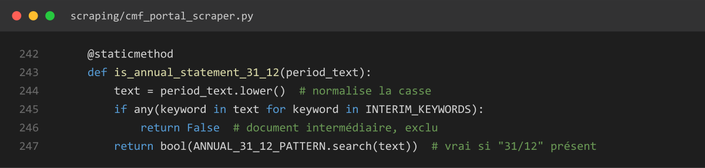

| Ligne(s) | Explication |
|---|---|
| 242-243 | Méthode statique, reçoit le texte de la période |
| 244 | Normalise la casse |
| 245-246 | Si "intermédiaire" est présent : exclu |
| 247 | Vrai seulement si le motif "31/12" est présent |

**Utilité** : exclut les rapports intermédiaires (semestriels) pour ne garder que les documents annuels, comparables d'une société à l'autre.

#### → Sous-fonction appelée en fin de page : `_go_to_next_page()`

**Rôle dans le trajet** : appelée par `collect_annual_statements()` (ligne 267) après avoir traité toutes les lignes d'une page — passe à la page suivante si elle existe.

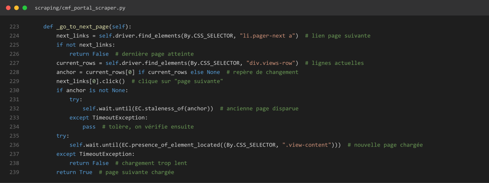

| Ligne(s) | Explication |
|---|---|
| 223-226 | Définition ; si pas de lien "page suivante" : dernière page atteinte |
| 227-229 | Repère les lignes actuelles, clique sur "page suivante" |
| 230-234 | Attend que l'ancienne page disparaisse (tolère un timeout) |
| 235-238 | Attend que la nouvelle page soit chargée (sinon échec) |
| 239 | Page suivante chargée avec succès |

**Utilité** : les résultats du portail CMF sont paginés — sans cette fonction, seule la première page serait lue.

### → Sous-fonction appelée ensuite : `_verify_pdf_link()`

**Rôle dans le trajet** : appelée par `extract_and_store()` (ligne 312), pour chaque année non encore en base — vérifie que le lien PDF répond réellement, avant de l'enregistrer.

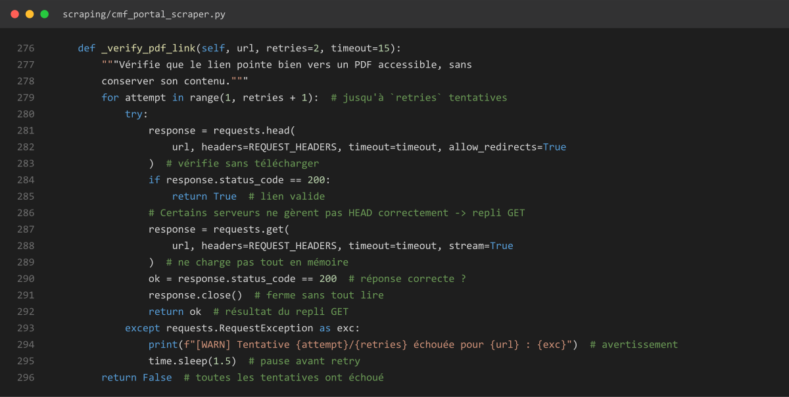

| Ligne(s) | Explication |
|---|---|
| 276-278 | Définition (2 tentatives, timeout 15s), docstring |
| 279 | Boucle sur les tentatives |
| 280-283 | Requête HEAD (ne télécharge pas le contenu) |
| 284-285 | Si code 200 : lien valide |
| 286 | Commentaire : certains serveurs gèrent mal HEAD |
| 287-289 | Repli : requête GET en streaming (pas tout en mémoire) |
| 290-292 | Vérifie le code, ferme la connexion, renvoie le résultat |
| 293-295 | En cas d'erreur réseau : avertissement, pause, réessaie |
| 296 | Si toutes les tentatives échouent : False |

**Utilité** : évite d'enregistrer en base un lien mort — sans elle, un lien cassé passerait inaperçu jusqu'à ce qu'un utilisateur clique dessus.

### → Sous-fonction appelée en dernier : `save_document()` — ★ écriture en base

**Rôle dans le trajet** : appelée par `extract_and_store()` (ligne 316) — **c'est ici que le trajet de la donnée se termine** : les métadonnées (pas le PDF lui-même) sont écrites dans la table `documents` de MySQL. Fonction partagée par toutes les sources (fichier `database/repository.py`, pas `cmf_portal_scraper.py`).

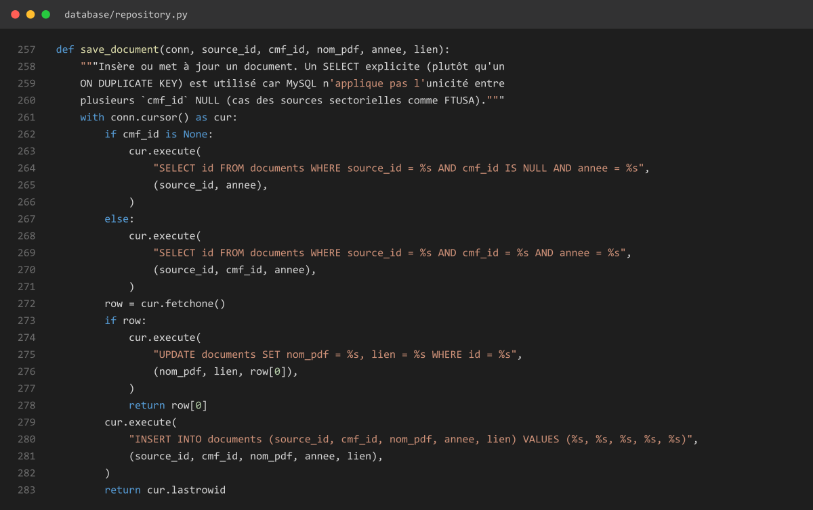

| Ligne(s) | Explication |
|---|---|
| 257-260 | Définition, docstring : pourquoi un SELECT explicite plutôt qu'un ON DUPLICATE KEY |
| 261 | Ouvre un curseur SQL |
| 262-266 | Si pas de société associée (source sectorielle) : cherche par source+année |
| 267-271 | Sinon : cherche par source+société+année |
| 272 | Récupère la ligne trouvée (ou rien) |
| 273-277 | Si elle existe déjà : met à jour nom et lien (UPDATE) |
| 278 | Renvoie l'id existant |
| 279-282 | Sinon : insère une nouvelle ligne (INSERT) |
| 283 | Renvoie l'id nouvellement créé |

**Utilité** : point d'arrivée du trajet — c'est la seule fonction qui écrit réellement dans MySQL ; tout ce qui précède ne fait que préparer, filtrer et vérifier la donnée avant cet instant.

---

## Étape 7 — `close()` — fermeture (fin du cycle)

**Rôle dans le trajet** : appelée par le code appelant (`pipelines/cmf_pipeline.py`) une fois **toutes** les sociétés traitées — pas après chaque société. Ferme proprement le navigateur et la connexion base.

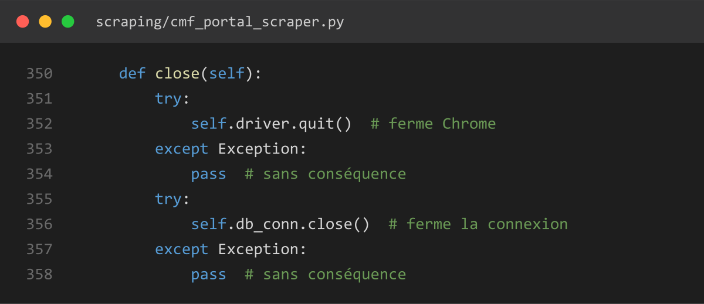

| Ligne(s) | Explication |
|---|---|
| 350 | Définition de la méthode |
| 351-354 | Ferme Chrome (ignore les erreurs de fermeture) |
| 355-358 | Ferme la connexion base (ignore les erreurs de fermeture) |

**Utilité** : libère les ressources (processus Chrome, connexion MySQL) — sans elle, des processus Chrome resteraient ouverts en arrière-plan à chaque exécution du pipeline.

---

*Fin du trajet pour la source CMF (scraping → stockage). Les 7 autres sources suivront le même principe une fois cette partie validée.*
