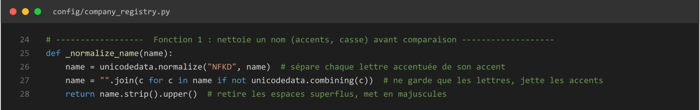

# Résumé fonctions

> Document de référence : une explication par fonction, regroupée par fichier source. Alimenté au fil des sessions, sert de matière pour les schémas de la présentation.

## config/company_registry.py

### _normalize_name(name)

| Ligne | Explication |
|---|---|
| 24 | Bannière : Fonction 1, nettoie un nom avant comparaison |
| 25 | Définition de la fonction, prend un nom en paramètre |
| 26 | Sépare chaque lettre accentuée de son accent (ex: "é" → "e" + accent) |
| 27 | Ne garde que les lettres, jette les accents séparés à l'étape précédente |
| 28 | Retire les espaces en trop, met tout en majuscules |

**Utilité** : uniformiser un nom de société avant de le comparer à un autre — sans ça, "Générale" et "GENERALE" (sans accent) seraient vus comme deux mots différents.
