# Résumé fonctions — Trajet de la donnée

> **Logique de ce document** : au lieu de lister les fonctions fichier par
> fichier, on suit **une donnée réelle** (un état financier annuel d'une
> société) tout au long de son trajet, fonction par fonction, **dans l'ordre
> réel d'exécution** — depuis le moment où elle est scrapée sur le portail
> CMF jusqu'au moment où elle est écrite en base MySQL. Chaque étape montre
> la capture d'écran réelle du code, une explication ligne par ligne, et une
> phrase "Utilité". On s'arrête **avant l'extraction** (le calcul des KPI à
> partir des PDF stockés est une phase séparée, documentée plus tard).
>
> **Pilote de cette logique : la source CMF** (`scraping/cmf_portal_scraper.py`),
> car c'est la source la plus complète (14 fonctions, toutes les étapes du
> trajet y sont visibles). Une fois cette partie validée, le même principe
> sera appliqué aux 7 autres sources (FTUSA, CGA, BVMT, INS, ENQUETE, Atlas
> Magazine, IlBoursa).

---

## Vue d'ensemble du trajet (source CMF)

```
__init__()                    -> ouvre Chrome + la base, fixe la fenêtre d'années
   |
run()                         -> orchestre tout, relance ×3 si timeout
   |
   ├─ open_page()              -> charge la page du portail CMF
   |
   ├─ select_company()         -> sélectionne la société dans le menu
   |     ├─ _wait_for_filtered_options()
   |     └─ _match_option()
   |
   ├─ click_search()           -> lance la recherche
   |
   └─ extract_and_store()      -> filtre, déduplique, enregistre
         ├─ collect_annual_statements()
         |     ├─ _parse_current_page()
         |     ├─ is_annual_statement_31_12()
         |     └─ _go_to_next_page()
         ├─ _verify_pdf_link()
         └─ save_document()    -> ★ ÉCRITURE EN BASE (fin du trajet ici)

close()                       -> ferme Chrome + la base (après toutes les sociétés)
```

---

## Étape 1 — `__init__()` — mise en place

**Rôle dans le trajet** : premier appel, avant toute donnée. Configure le
navigateur Chrome piloté, ouvre la connexion à la base, et calcule la
fenêtre des 10-11 dernières années à conserver.


| Ligne(s) | Explication |
|---|---|
| 64 | Définition, reçoit le registre des sociétés et un mode headless |
| 65 | Stocke le registre des 24 sociétés |
| 67 | Crée les options de lancement de Chrome |
| 68-69 | Mode headless (navigateur invisible) si demandé |
| 70 | Fixe une taille de fenêtre |
| 71-73 | Options de stabilité (GPU, sandbox, mémoire) |
| 74 | Utilise le même User-Agent que les requêtes HTTP directes |
| 76 | Lance Chrome avec ces options |
| 77 | Attente maximale de 20s pour les éléments de la page |
| 79-81 | Commentaire : pourquoi une fenêtre de "10 dernières années" |
| 82-84 | Calcule les bornes basse et haute de la fenêtre d'années |
| 86-88 | Crée la base si besoin, ouvre la connexion, crée/migre les tables |
| 89 | Récupère (ou crée) l'id de la source "CMF" |

**Utilité** : point de départ du trajet — sans cette étape, aucune page ne peut être chargée ni aucune donnée enregistrée.

---

## Étape 2 — `run()` — orchestrateur

**Rôle dans le trajet** : appelé une fois par société à traiter ; enchaîne
les 4 étapes suivantes dans l'ordre, et relance toute la séquence (page
fraîche) jusqu'à 3 fois en cas de timeout.


| Ligne(s) | Explication |
|---|---|
| 329 | Définition de la méthode, 3 tentatives par défaut |
| 330-334 | Commentaire : pourquoi on relance tout plutôt qu'une seule étape |
| 335 | Mémorise la dernière erreur rencontrée |
| 336 | Boucle sur les tentatives (1 à 3) |
| 337 | Début du bloc "essayer" |
| 338 | Ouvre la page du portail CMF |
| 339 | Sélectionne la société dans le menu |
| 340 | Clique sur le bouton de recherche |
| 341 | Si tout est OK : extrait, enregistre, et sort de la fonction |
| 342 | Intercepte une erreur de timeout |
| 343 | Mémorise cette erreur |
| 344 | Journalise la tentative échouée |
| 345-346 | Si ce n'était pas la dernière tentative, attend 2 secondes |
| 347 | Si tout a échoué, relève la dernière erreur |

**Utilité** : garantit qu'un incident réseau ponctuel (page lente, widget pas encore prêt) ne fait pas perdre toute une société — on repart de zéro plutôt que de continuer dans un état incohérent.

---

## Étape 3 — `open_page()` — chargement de la page

**Rôle dans le trajet** : premier appel fait par `run()`. Charge la page du portail CMF où se trouve le menu de sélection des sociétés.


| Ligne(s) | Explication |
|---|---|
| 96 | Définition de la méthode |
| 97 | Trace console |
| 98 | Charge l'URL du portail CMF |
| 99 | Attend que le menu de sélection soit chargé |

**Utilité** : sans page chargée, aucun menu n'est disponible pour l'étape suivante.

---

## Étape 4 — `select_company()` — sélection de la société

**Rôle dans le trajet** : appelée par `run()` juste après `open_page()`. Sélectionne la société voulue dans le menu déroulant (widget JS "Chosen", avec repli sur le `<select>` HTML natif si le widget ne charge pas).


| Ligne(s) | Explication |
|---|---|
| 102-104 | Définition, récupère le nom exact attendu par le portail, trace console |
| 106-108 | Commentaire + construction de l'id du widget Chosen |
| 109-111 | Attend le widget, clique pour ouvrir le menu déroulant |
| 113-119 | Attend le champ de recherche, le vide, tape le nom de la société |
| 121-122 | Récupère les options filtrées, cherche celle qui correspond |
| 123-126 | Si aucune correspondance : referme le menu, déclenche le repli |
| 128-130 | Sinon : clique sur l'option, confirme, sort de la fonction |
| 131-132 | Si le widget a timeout : avertissement, passe au repli natif |
| 134-137 | Commentaire : pourquoi le repli lit l'attribut "value" |
| 138-140 | Attend le `<select>` natif, prépare le wrapper Selenium |
| 141-146 | Boucle sur les options natives ; si une correspond : sélectionne et sort |
| 147 | Si rien ne correspond nulle part : lève une erreur explicite |

**Utilité** : identifie précisément quelle société consulter — une erreur ici ferait extraire les données de la mauvaise société.

### → Sous-fonction appelée : `_wait_for_filtered_options()`

**Rôle dans le trajet** : appelée par `select_company()` (ligne 121) juste après avoir tapé le nom recherché — attend que le widget affiche les résultats filtrés.


| Ligne(s) | Explication |
|---|---|
| 150 | Définition, timeout par défaut 5s |
| 151-152 | Calcule l'heure limite, initialise la liste des options |
| 153-155 | Tant que le délai n'est pas dépassé : cherche les options actives visibles |
| 156-157 | Dès qu'il y en a, arrête la boucle |
| 158 | Sinon, petite pause avant de retester |
| 159 | Renvoie les options trouvées (éventuellement vide) |

**Utilité** : le filtrage du menu par JavaScript prend un instant — sans cette attente active, la liste lue serait vide ou incomplète.

### → Sous-fonction appelée : `_match_option()`

**Rôle dans le trajet** : appelée par `select_company()` (ligne 122) juste après — trouve, parmi les options filtrées, celle qui correspond au nom cherché.


| Ligne(s) | Explication |
|---|---|
| 162-163 | Méthode statique, reçoit les options et le nom cherché |
| 164 | Normalise espaces et casse du nom cherché |
| 165-167 | 1ère passe : cherche une correspondance exacte |
| 168-170 | 2e passe (repli) : cherche une correspondance partielle |
| 171 | Aucune correspondance trouvée |

**Utilité** : tolère de petites différences de formatage (espaces, casse) entre le nom du registre et le texte affiché sur le site, sans jamais matcher au hasard.

---

## Étape 5 — `click_search()` — lancement de la recherche

**Rôle dans le trajet** : appelée par `run()` juste après `select_company()`. Clique sur "Rechercher" et attend que la page se recharge avec les résultats.


| Ligne(s) | Explication |
|---|---|
| 174-175 | Définition, trace console |
| 176-179 | Commentaire : pourquoi capturer l'ancien contenu avant de cliquer |
| 180-181 | Repère l'ancien bloc de résultats (avant clic) |
| 183-186 | Attend que le bouton "Rechercher" soit cliquable, clique dessus |
| 188-192 | Attend que l'ancien contenu disparaisse (tolère un timeout) |
| 194 | Attend que le nouveau contenu soit chargé |

**Utilité** : garantit qu'on lit les nouveaux résultats et non un résidu de l'ancienne page (source d'erreurs `StaleElementReferenceException` si on ne l'attend pas).

---

## Étape 6 — `extract_and_store()` — filtrage, déduplication, enregistrement

**Rôle dans le trajet** : appelée par `run()` en dernier — c'est elle qui orchestre la fin du trajet (collecte → vérification → écriture en base). Ci-dessous les 3 sous-fonctions qu'elle appelle, dans l'ordre.


| Ligne(s) | Explication |
|---|---|
| 299 | Définition de la méthode |
| 300 | Journalise le début de l'extraction |
| 301 | Récupère la liste des états financiers annuels déjà filtrés |
| 303-304 | Récupère le nom de la société et son id interne en base |
| 306 | Compteur de documents nouvellement enregistrés |
| 307-308 | Boucle sur chaque année trouvée, dans l'ordre |
| 309 | Vérifie si le document existe déjà en base (déduplication) |
| 310-311 | Si oui : journalise et passe à l'année suivante |
| 312 | Sinon, vérifie que le lien PDF répond bien |
| 313-314 | Si le lien est invalide : journalise et passe à l'année suivante |
| 315-316 | Construit le nom du fichier, enregistre les métadonnées en base |
| 317-318 | Incrémente le compteur, journalise la confirmation |

**Utilité** : c'est la fonction qui décide, pour chaque année collectée, si la donnée doit réellement être écrite en base (pas déjà présente, lien PDF valide).

### → Sous-fonction appelée en premier : `collect_annual_statements()`

**Rôle dans le trajet** : appelée par `extract_and_store()` (ligne 301), avant toute vérification — parcourt toutes les pages de résultats et applique le filtre "annuel au 31/12, 10-11 dernières années".


| Ligne(s) | Explication |
|---|---|
| 250-253 | Définition (limite 30 pages), docstring |
| 254 | Résultat : dictionnaire année -> lien |
| 255-256 | Boucle sur les pages, puis sur les lignes de la page courante |
| 257-258 | Ne garde que les documents annuels au 31/12 |
| 259-261 | Extrait l'année (4 chiffres) ; si illisible, ignorée |
| 262-264 | Convertit en entier ; si hors fenêtre des 10-11 ans, ignorée |
| 265-266 | Garde la 1ère occurrence rencontrée pour cette année |
| 267-268 | Passe à la page suivante, sinon arrête |
| 269 | Renvoie le résultat final |

**Utilité** : c'est le vrai point de filtrage de la donnée — parmi tous les documents listés sur le site (annuels, intermédiaires, toutes années), ne garde que ceux qui nous intéressent.

#### → Sous-fonction appelée dans la boucle : `_parse_current_page()`

**Rôle dans le trajet** : appelée par `collect_annual_statements()` (ligne 256) à chaque page — lit les lignes de résultats actuellement affichées.


| Ligne(s) | Explication |
|---|---|
| 201-203 | Définition, liste vide, récupère toutes les lignes de résultats |
| 204 | Boucle sur chaque ligne |
| 206-214 | Récupère le texte de l'année, de la période, et le lien du PDF |
| 215-216 | Si un élément attendu manque : ligne ignorée |
| 217-218 | Si année ou lien manquant : ligne ignorée |
| 219 | Ajoute la ligne retenue au résultat |
| 220 | Renvoie les lignes de cette page |

**Utilité** : c'est ici que la donnée brute (année, période, lien PDF) est réellement lue depuis le HTML de la page — avant cette fonction, ce ne sont que des éléments visuels.

#### → Sous-fonction appelée sur chaque ligne lue : `is_annual_statement_31_12()`

**Rôle dans le trajet** : appelée par `collect_annual_statements()` (ligne 257) sur chaque ligne lue par `_parse_current_page()` — dit si c'est un état financier annuel au 31/12.


| Ligne(s) | Explication |
|---|---|
| 242-243 | Méthode statique, reçoit le texte de la période |
| 244 | Normalise la casse |
| 245-246 | Si "intermédiaire" est présent : exclu |
| 247 | Vrai seulement si le motif "31/12" est présent |

**Utilité** : exclut les rapports intermédiaires (semestriels) pour ne garder que les documents annuels, comparables d'une société à l'autre.

#### → Sous-fonction appelée en fin de page : `_go_to_next_page()`

**Rôle dans le trajet** : appelée par `collect_annual_statements()` (ligne 267) après avoir traité toutes les lignes d'une page — passe à la page suivante si elle existe.


| Ligne(s) | Explication |
|---|---|
| 223-226 | Définition ; si pas de lien "page suivante" : dernière page atteinte |
| 227-229 | Repère les lignes actuelles, clique sur "page suivante" |
| 230-234 | Attend que l'ancienne page disparaisse (tolère un timeout) |
| 235-238 | Attend que la nouvelle page soit chargée (sinon échec) |
| 239 | Page suivante chargée avec succès |

**Utilité** : les résultats du portail CMF sont paginés — sans cette fonction, seule la première page serait lue.

### → Sous-fonction appelée ensuite : `_verify_pdf_link()`

**Rôle dans le trajet** : appelée par `extract_and_store()` (ligne 312), pour chaque année non encore en base — vérifie que le lien PDF répond réellement, avant de l'enregistrer.


| Ligne(s) | Explication |
|---|---|
| 276-278 | Définition (2 tentatives, timeout 15s), docstring |
| 279 | Boucle sur les tentatives |
| 280-283 | Requête HEAD (ne télécharge pas le contenu) |
| 284-285 | Si code 200 : lien valide |
| 286 | Commentaire : certains serveurs gèrent mal HEAD |
| 287-289 | Repli : requête GET en streaming (pas tout en mémoire) |
| 290-292 | Vérifie le code, ferme la connexion, renvoie le résultat |
| 293-295 | En cas d'erreur réseau : avertissement, pause, réessaie |
| 296 | Si toutes les tentatives échouent : False |

**Utilité** : évite d'enregistrer en base un lien mort — sans elle, un lien cassé passerait inaperçu jusqu'à ce qu'un utilisateur clique dessus.

### → Sous-fonction appelée en dernier : `save_document()` — ★ écriture en base

**Rôle dans le trajet** : appelée par `extract_and_store()` (ligne 316) — **c'est ici que le trajet de la donnée se termine** : les métadonnées (pas le PDF lui-même) sont écrites dans la table `documents` de MySQL. Fonction partagée par toutes les sources (fichier `database/repository.py`, pas `cmf_portal_scraper.py`).


| Ligne(s) | Explication |
|---|---|
| 257-260 | Définition, docstring : pourquoi un SELECT explicite plutôt qu'un ON DUPLICATE KEY |
| 261 | Ouvre un curseur SQL |
| 262-266 | Si pas de société associée (source sectorielle) : cherche par source+année |
| 267-271 | Sinon : cherche par source+société+année |
| 272 | Récupère la ligne trouvée (ou rien) |
| 273-277 | Si elle existe déjà : met à jour nom et lien (UPDATE) |
| 278 | Renvoie l'id existant |
| 279-282 | Sinon : insère une nouvelle ligne (INSERT) |
| 283 | Renvoie l'id nouvellement créé |

**Utilité** : point d'arrivée du trajet — c'est la seule fonction qui écrit réellement dans MySQL ; tout ce qui précède ne fait que préparer, filtrer et vérifier la donnée avant cet instant.

---

## Étape 7 — `close()` — fermeture (fin du cycle)

**Rôle dans le trajet** : appelée par le code appelant (`pipelines/cmf_pipeline.py`) une fois **toutes** les sociétés traitées — pas après chaque société. Ferme proprement le navigateur et la connexion base.


| Ligne(s) | Explication |
|---|---|
| 350 | Définition de la méthode |
| 351-354 | Ferme Chrome (ignore les erreurs de fermeture) |
| 355-358 | Ferme la connexion base (ignore les erreurs de fermeture) |

**Utilité** : libère les ressources (processus Chrome, connexion MySQL) — sans elle, des processus Chrome resteraient ouverts en arrière-plan à chaque exécution du pipeline.

---

*Fin du trajet pour la source CMF (scraping → stockage).*

> **Version interactive** : ce même trajet (CMF + les 7 sources ci-dessous), avec le code complet cliquable de chaque fonction, est disponible en version animée : [Trajet CMF — artefact interactif](https://claude.ai/code/artifact/52f949f2-aee8-49d8-8a1a-af7cb16cfa7b).

---

# Trajet de la donnée — Phase Scraping — Source FTUSA

FTUSA publie des rapports **sectoriels** (pas de société associée, `cmf_id` NULL). Contrairement à CMF, il n'y a pas de sélection dans un menu : le trajet part directement de la liste des PDF sur une page unique.

```
sync_documents()               -> orchestre tout
   ├─ _collect_main_pdf_links()  -> liste les PDF de la page
   │     └─ _get_with_retries()
   ├─ _get_with_retries()        -> réutilisée pour télécharger chaque PDF
   ├─ _detect_report_year()      -> lit l'année dans le contenu du PDF
   └─ save_document()            -> ★ ÉCRITURE EN BASE
```

## Étape 1 — `sync_documents()`

**Rôle dans le trajet** : point d'entrée unique, appelée par `pipelines/run_pipeline.py`.

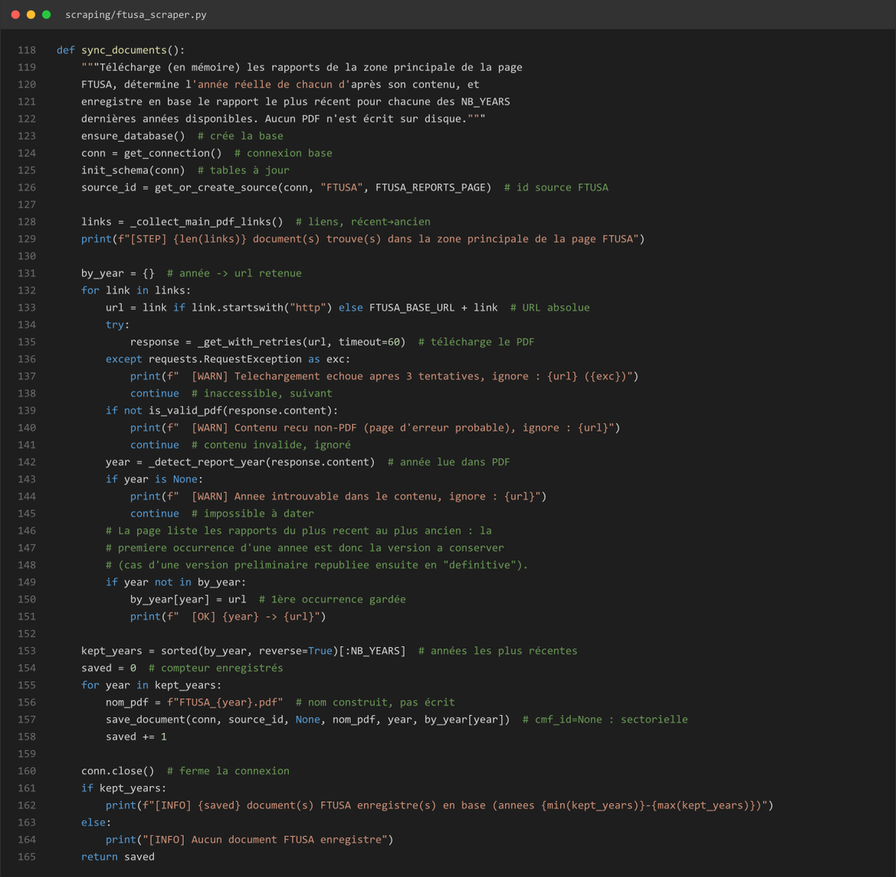

| Ligne(s) | Explication |
|---|---|
| 118-122 | Définition, docstring |
| 123-126 | Prépare la base, récupère l'id de la source FTUSA |
| 128-129 | Récupère les liens PDF de la page (du plus récent au plus ancien) |
| 131-138 | Boucle : télécharge chaque PDF (en mémoire, jamais écrit sur disque) |
| 139-141 | Si le contenu n'est pas un vrai PDF (page d'erreur) : ignoré |
| 142-145 | Lit l'année dans le contenu ; si introuvable : ignoré |
| 146-151 | Garde la 1ère occurrence de chaque année (la plus récente publiée) |
| 153-158 | Ne garde que les `NB_YEARS` années les plus récentes, écrit en base |
| 160-165 | Ferme la connexion, journalise le résumé |

**Utilité** : seule fonction à orchestrer toute la chaîne pour cette source.

## Étape 2 — `_collect_main_pdf_links()`

**Rôle dans le trajet** : appelée en premier par `sync_documents()` — liste tous les liens PDF de la zone principale de la page (exclut le bloc « à la une »).

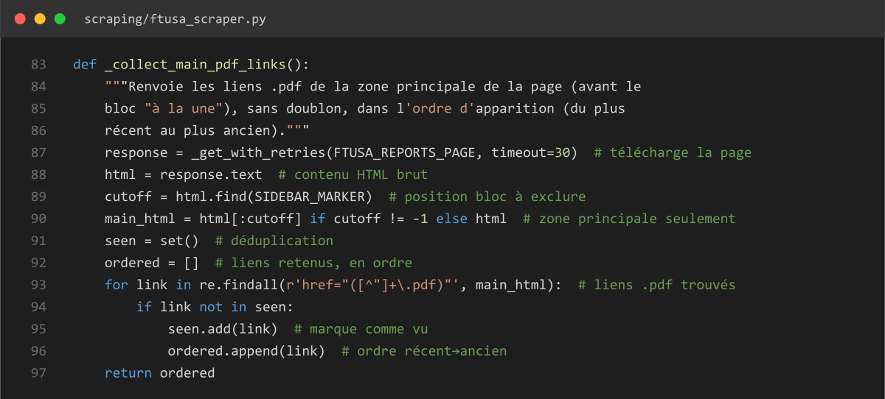

| Ligne(s) | Explication |
|---|---|
| 83-86 | Définition, docstring |
| 87 | Télécharge la page HTML des rapports |
| 89-90 | Coupe le HTML avant le bloc « à la une » |
| 91-96 | Extrait tous les liens `.pdf`, sans doublon, dans l'ordre d'apparition |
| 97 | Renvoie la liste |

**Utilité** : isole les vrais rapports annuels des publications hors-sujet en bas de page.

## Étape 3 — `_get_with_retries()`

**Rôle dans le trajet** : appelée dans `_collect_main_pdf_links()`, puis réutilisée telle quelle par `sync_documents()` pour télécharger chaque PDF candidat.


| Ligne(s) | Explication |
|---|---|
| 63-65 | Définition (3 tentatives par défaut), docstring |
| 66 | Boucle sur les tentatives |
| 68-70 | Requête GET, lève si erreur HTTP, renvoie si succès |
| 71-73 | Si dernière tentative épuisée : relève l'erreur |
| 74-75 | Sinon : journalise et patiente avant de réessayer |

**Utilité** : absorbe les échecs réseau ponctuels sans faire échouer toute la source.

## Étape 4 — `_detect_report_year()`

**Rôle dans le trajet** : appelée par `sync_documents()` sur chaque PDF téléchargé et validé — lit l'année dans le contenu (pas le nom de fichier).

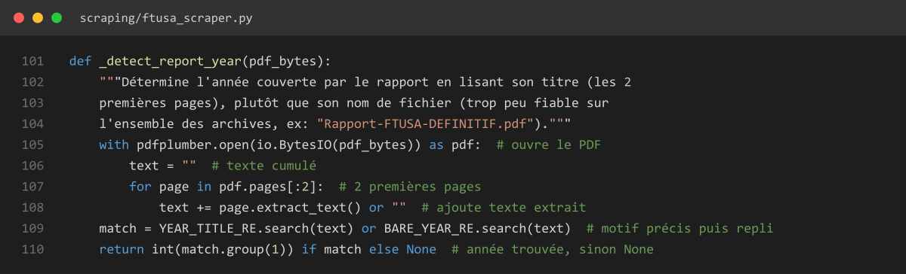

| Ligne(s) | Explication |
|---|---|
| 101-104 | Définition, docstring |
| 105-108 | Ouvre le PDF, lit le texte des 2 premières pages |
| 109 | Cherche le motif "en 2024", sinon une année isolée |
| 110 | Renvoie l'année trouvée, sinon `None` |

**Utilité** : le nom de fichier n'est pas fiable sur 25 ans d'archives — le contenu, si.

## Étape 5 — `save_document()` — ★ écriture en base

Identique à la fonction utilisée par CMF (fichier `database/repository.py`, lignes 257-283, voir plus haut). `cmf_id=None` ici : c'est une source sectorielle, sans société associée.

---

# Trajet de la donnée — Phase Scraping — Source CGA

Comme FTUSA, le CGA publie des rapports **sectoriels**. Particularité : les rapports récents (2023+) ne sont plus liés en PDF direct mais via une page de news intermédiaire hébergée sur Google Drive.

```
sync_documents()                -> orchestre tout
   └─ _fetch_report_links()       -> liens PDF directs + suivi de lien
         ├─ _get_with_retries()
         └─ _gdrive_download_url()  -> construit le lien Drive
   └─ save_document()             -> ★ ÉCRITURE EN BASE
```

## Étape 1 — `sync_documents()`

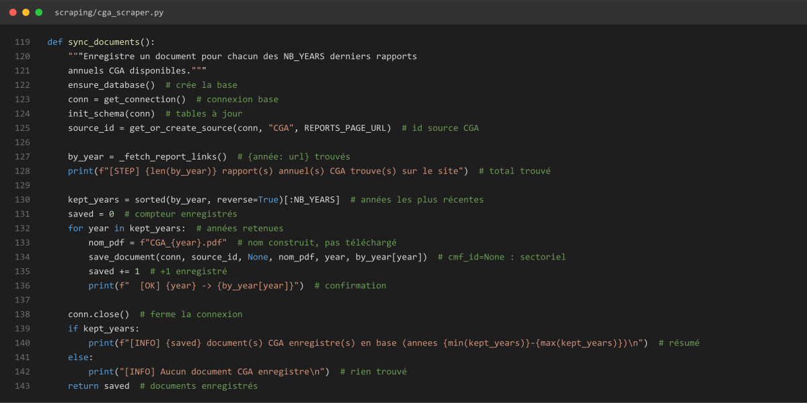

| Ligne(s) | Explication |
|---|---|
| 119-121 | Définition, docstring |
| 122-125 | Prépare la base, récupère l'id de la source CGA |
| 127-128 | Récupère `{année: url}` de tous les rapports trouvés |
| 130-136 | Ne garde que les années les plus récentes, écrit en base |
| 138-143 | Ferme la connexion, journalise le résumé |

**Utilité** : point d'entrée unique pour la source CGA.

## Étape 2 — `_fetch_report_links()`

**Rôle dans le trajet** : appelée par `sync_documents()` — suit automatiquement la chaîne page principale → page news → Google Drive pour les rapports récents.

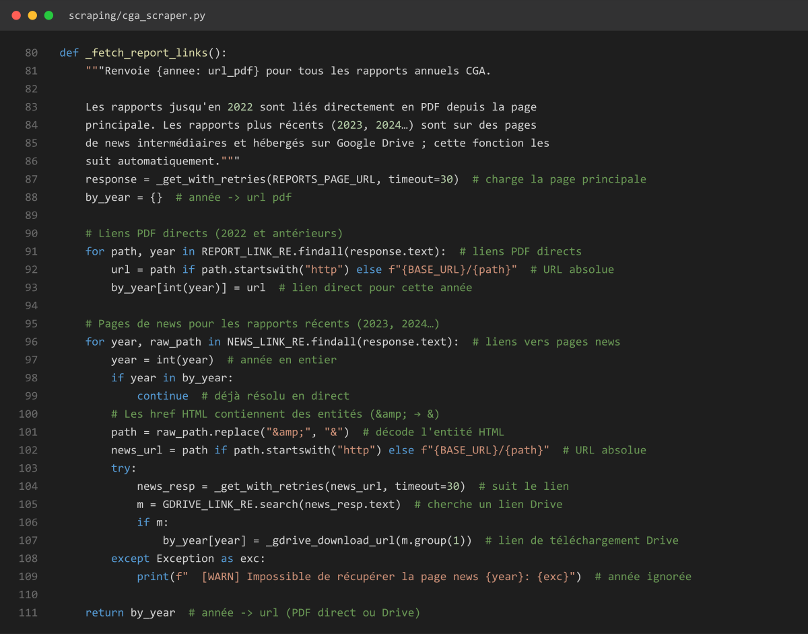

| Ligne(s) | Explication |
|---|---|
| 80-86 | Définition, docstring (explique la double convention 2022- / 2023+) |
| 87-88 | Charge la page principale |
| 91-93 | Liens PDF directs (2022 et antérieurs) |
| 96-99 | Pour chaque lien vers une page news récente : ignore si déjà résolu |
| 100-107 | Décode l'URL, suit le lien, cherche un lien Google Drive dans la page news |
| 108-109 | Si la page news échoue : journalise, année ignorée |
| 111 | Renvoie le dictionnaire complet |

**Utilité** : gère les 2 conventions de publication (PDF direct historique / page news + Drive récente) de façon transparente.

## Étape 3 — `_get_with_retries()`

Identique en principe aux autres sources (3 tentatives, voir capture).

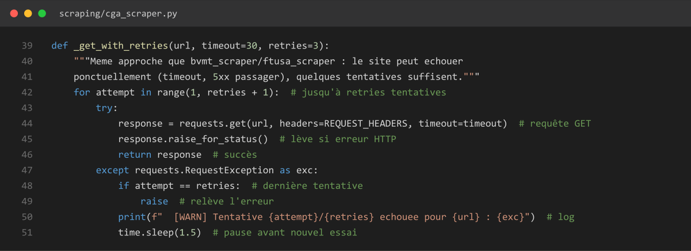

**Utilité** : même filet de sécurité réseau que les 7 autres sources.

## Étape 4 — `_gdrive_download_url()`

**Rôle dans le trajet** : appelée quand un lien Google Drive est trouvé sur une page news — transforme un lien de visualisation en lien de téléchargement direct.

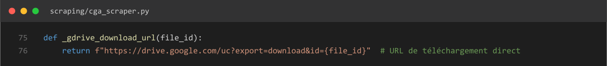

**Utilité** : sans cette conversion, le lien stocké en base pointerait vers une page web, pas vers le PDF.

## Étape 5 — `save_document()` — ★ écriture en base

Identique à CMF/FTUSA (`database/repository.py`, lignes 257-283). `cmf_id=None` : source sectorielle.

---

# Trajet de la donnée — Phase Scraping — Source INS

**Cas particulier** : INS n'a **aucun PDF** à extraire plus tard — le trajet se termine directement par l'écriture du KPI (Population, PIB) sur un document « virtuel » sans lien réel.

```
sync_all()                       -> orchestre tout
   ├─ _fetch_series()              -> appelée 2× (Population, puis PIB)
   │     └─ _post_with_retries()    -> seule source en appel POST (API)
   ├─ _fetch_population_jan()      -> repli HTML pour années manquantes
   │     └─ _get_with_retries()
   ├─ save_document()              -> document virtuel (pas de PDF)
   └─ save_kpi_value()             -> ★ ÉCRITURE DU KPI (fin du trajet)
```

## Étape 1 — `sync_all()`

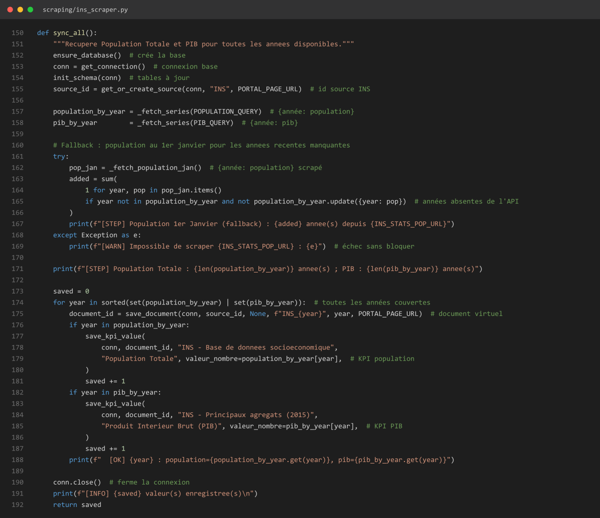

| Ligne(s) | Explication |
|---|---|
| 150-152 | Définition, docstring, prépare la base |
| 157-158 | Récupère Population et PIB via l'API (2 appels à `_fetch_series`) |
| 160-169 | Repli HTML : ajoute les années manquantes (tolère un échec) |
| 173-188 | Pour chaque année couverte : crée un document virtuel, écrit les KPI trouvés |
| 190-192 | Ferme la connexion, journalise |

**Utilité** : point d'entrée unique — contrairement aux autres sources, écrit directement des valeurs numériques, pas des métadonnées de PDF.

## Étape 2 — `_fetch_series()`

**Rôle dans le trajet** : appelée 2 fois (Population puis PIB) — interroge l'API INS et parse la réponse XML.

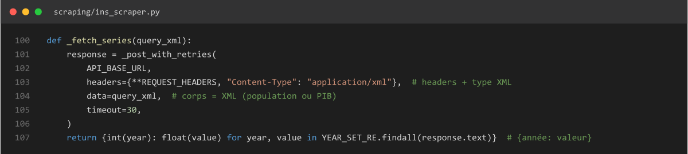

**Utilité** : une seule fonction générique pour les 2 indicateurs macro-économiques.

## Étape 3 — `_post_with_retries()`

**Rôle dans le trajet** : appelée par `_fetch_series()` — seule fonction du projet à interroger une API en **POST** plutôt qu'en GET.

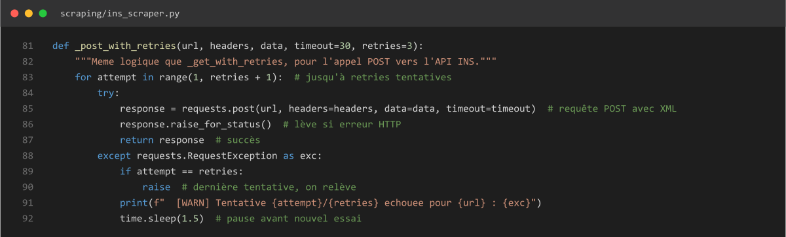

**Utilité** : même logique de tolérance aux pannes que `_get_with_retries()`, adaptée au POST.

## Étape 4 — `_fetch_population_jan()`

**Rôle dans le trajet** : appelée en repli si l'API ne couvre pas encore l'année la plus récente — scrape un tableau HTML.

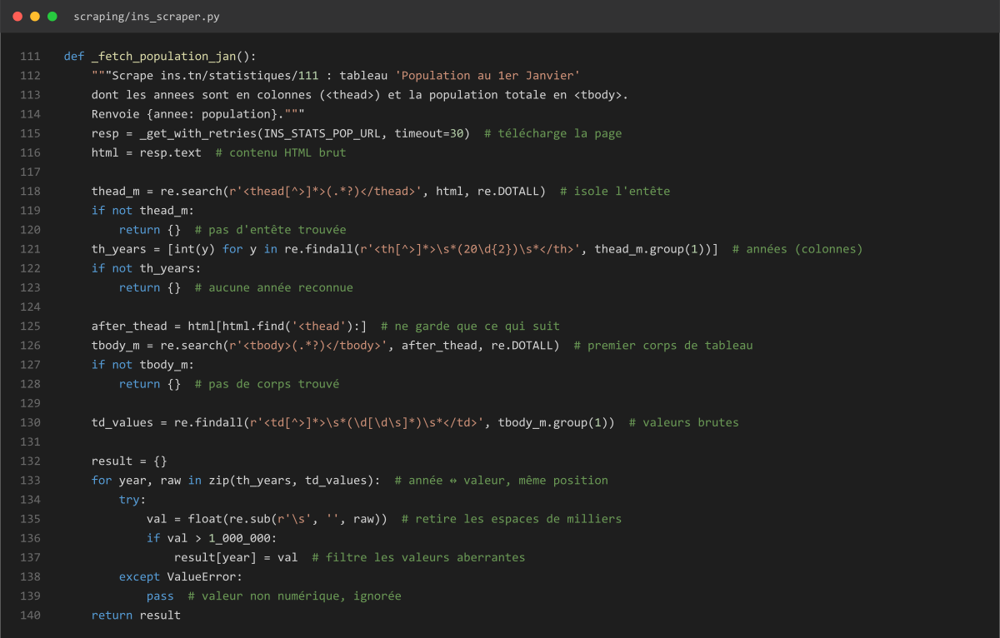

**Utilité** : filet de sécurité pour ne pas perdre l'année en cours en attendant la publication API.

## Étape 5 — `_get_with_retries()`

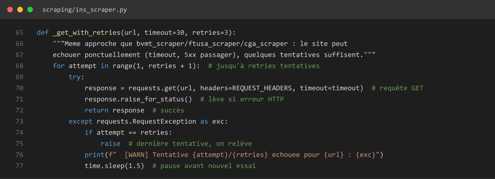

**Utilité** : même filet de sécurité réseau que les autres sources (utilisée ici pour la page HTML de repli).

## Étape 6-7 — `save_document()` + `save_kpi_value()` — ★ fin du trajet

`save_document()` crée un document virtuel par année (identique aux autres sources). `save_kpi_value()` (fichier `database/repository.py`, lignes 311-324) écrit ensuite directement la valeur numérique :

**Utilité** : contrairement aux 7 autres sources, INS n'a pas de phase d'extraction séparée — la donnée est finale dès le scraping.

---

# Trajet de la donnée — Phase Scraping — Source ENQUETE

**Cas particulier** : **aucun scraping ici**. Les chiffres (`ENQUETE_DATA`) sont transcrits à la main depuis le fichier Excel de l'enquête terrain STAR (voir docstring du fichier). Le trajet commence directement à l'écriture en base.

```
seed(conn)                -> point d'entrée unique (lancé une fois, manuellement)
   ├─ save_document()       -> crée le document "Enquête" (une fois)
   └─ save_kpi_value()      -> ★ ÉCRITURE EN BASE (appelée ~30 fois)
```

## Étape unique — `seed()`

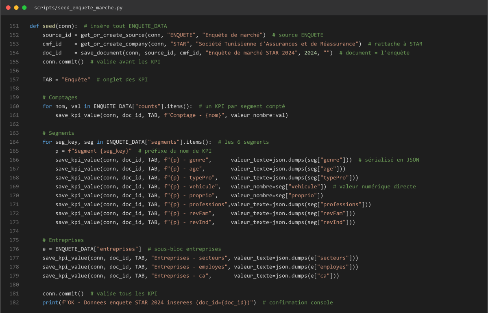

| Ligne(s) | Explication |
|---|---|
| 151-154 | Crée la source, rattache l'enquête à la société STAR, crée le document |
| 155 | Valide la création avant d'insérer les KPI |
| 157-161 | Un KPI par segment compté (Particuliers, Professionnels, etc.) |
| 164-173 | Pour chacun des 6 segments : 8 KPI (genre, âge, profession, revenus…) |
| 176-179 | 3 KPI pour le volet Entreprises (secteurs, effectifs, chiffre d'affaires) |
| 181-182 | Valide tout, confirme en console |

**Utilité** : script à lancer une seule fois (`python scripts/seed_enquete_marche.py`), idempotent grâce aux upserts de `save_kpi_value()`.

---

# Trajet de la donnée — Phase Scraping — Source BVMT

La source la plus riche : **3 volets indépendants** (statut de cotation, rapports ESG, données de marché), qui partagent tous la même reconnaissance de société via le registre CMF (`find_code_by_name`, cross-fichier avec `config/company_registry.py`).

```
sync_all()
   ├─ sync_status_cotation()      -> Volet 1 : statut "Cotée"
   │     ├─ _matched_insurance_companies()   -> réutilisée par les 3 volets
   │     │     ├─ _fetch_listed_insurance_companies()
   │     │     │     └─ _get_with_retries()
   │     │     └─ find_code_by_name()         -> cross-fichier (company_registry.py)
   │     ├─ save_document()       -> ★ traçabilité
   │     └─ save_kpi_value()      -> ★ statut "Cotée"
   ├─ sync_esg_documents()        -> Volet 2 : rapports ESG (réutilise ci-dessus)
   │     ├─ _fetch_esg_societe_ids()
   │     ├─ _fetch_esg_report_links()
   │     └─ _report_year()
   └─ sync_market_data()          -> Volet 3 : cours, ISIN, bulletin (réutilise ci-dessus)
         ├─ _bulletin_links_in_range()
         └─ _last_bulletin_of_year()
```

## Étape 1 — `sync_all()`

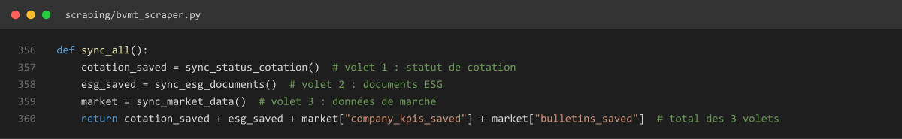

**Utilité** : orchestre les 3 volets indépendants.

## Volet 1 — `sync_status_cotation()`

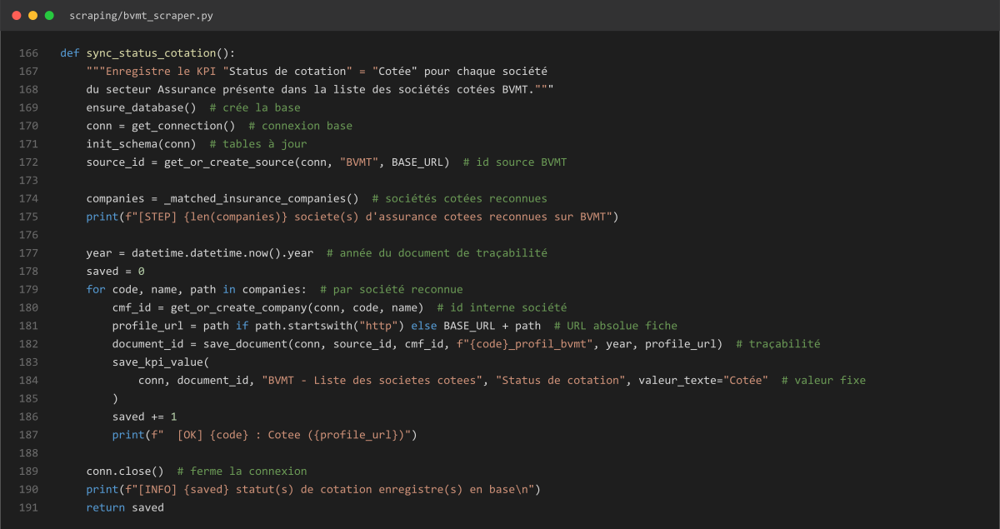

| Ligne(s) | Explication |
|---|---|
| 166-172 | Définition, docstring, prépare la base |
| 174-175 | Récupère les sociétés cotées reconnues |
| 179-187 | Pour chaque société : crée le document de traçabilité, écrit le KPI "Cotée" |
| 189-191 | Ferme la connexion, journalise |

**Utilité** : le simple fait d'apparaître dans la liste des sociétés cotées Assurance devient un KPI.

### → `_matched_insurance_companies()`

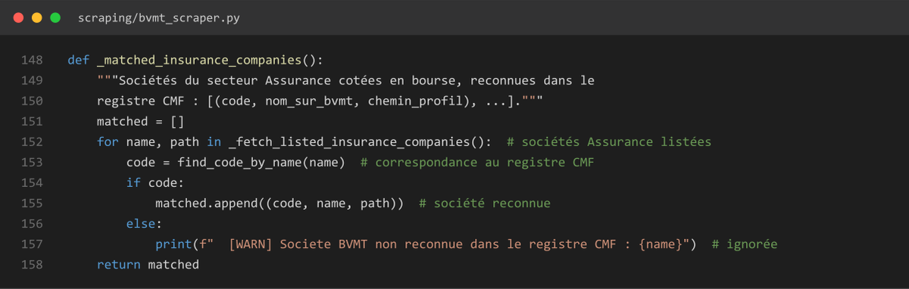

**Utilité** : le pont entre « ce qui est coté en bourse » et « ce que le registre CMF connaît » — réutilisée par les 3 volets.

### → → `_fetch_listed_insurance_companies()`

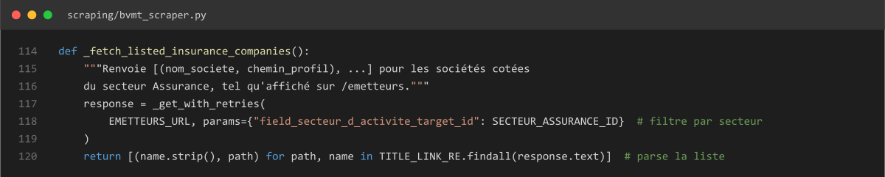

**Utilité** : liste dynamique, jamais codée en dur.

### → → → `_get_with_retries()`

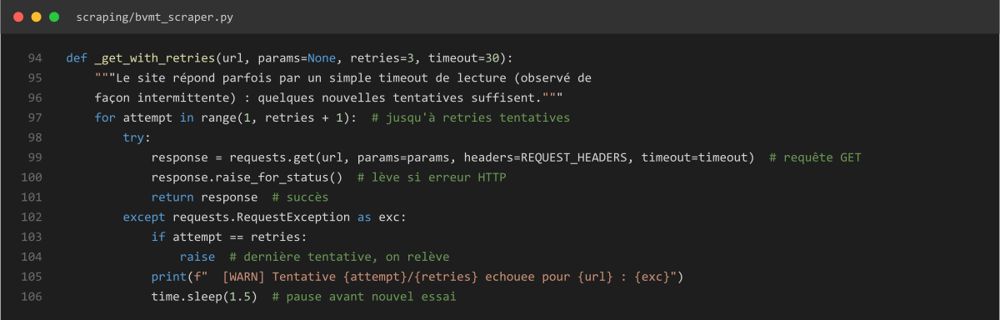

### → → `find_code_by_name()` (cross-fichier)

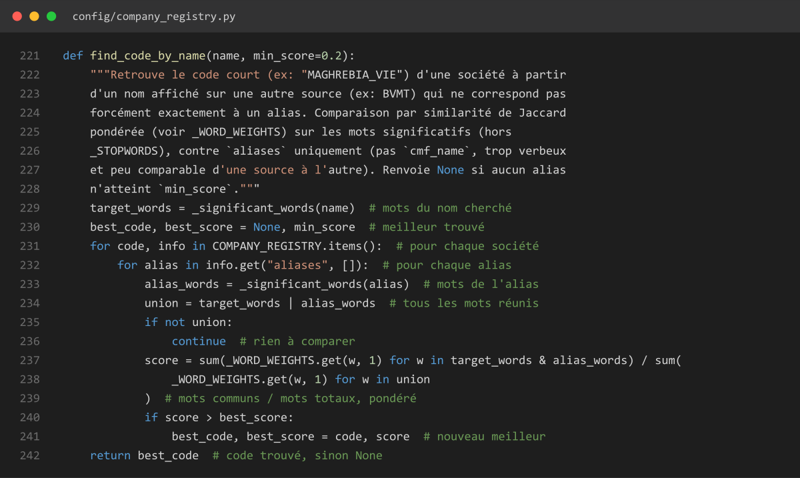

**Utilité** : comparaison par similarité de Jaccard pondérée sur les alias du registre CMF (voir la fiche `config/company_registry.py` pour le détail de l'algorithme).

### → `save_document()` + `save_kpi_value()` — ★ destinations volet 1


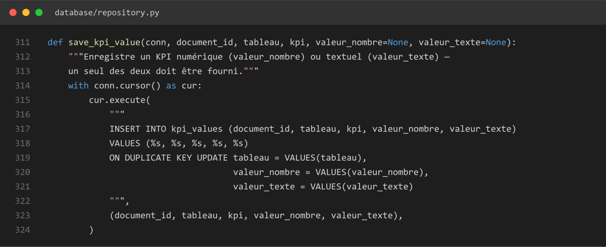

**Utilité** : `save_kpi_value()` est aussi réutilisée par le volet 3 (Mnemo, Dénomination, Nombre d'actions).

## Volet 2 — `sync_esg_documents()`

**Rôle dans le trajet** : réutilise `_matched_insurance_companies()` et `save_document()` déjà vues au volet 1.

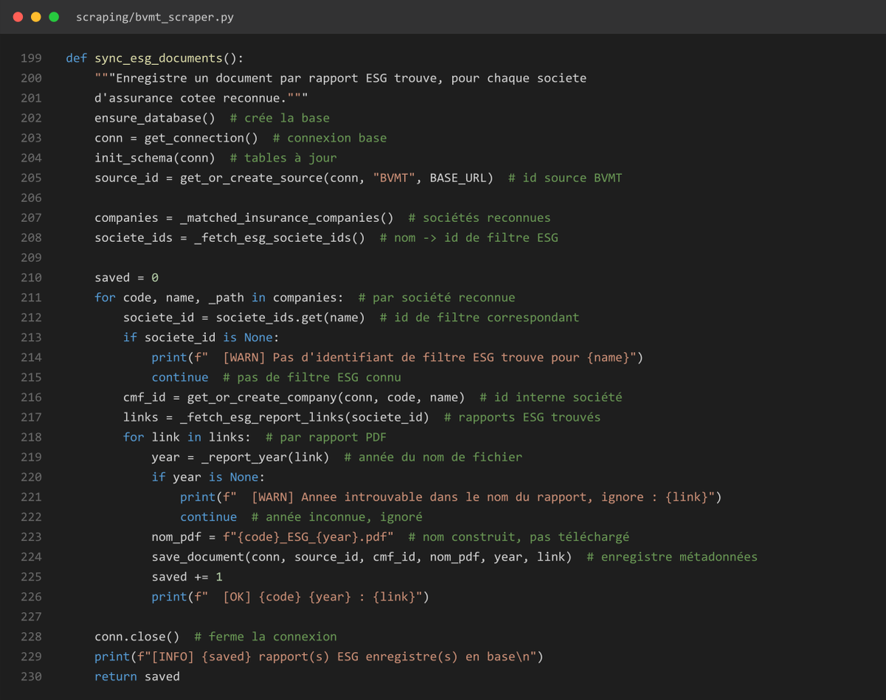

**Utilité** : se limite à enregistrer les documents ; l'extraction des KPI de gouvernance est une phase séparée.

### → `_fetch_esg_societe_ids()`

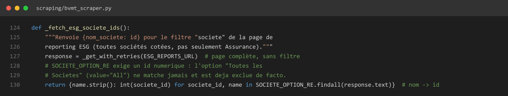

### → `_fetch_esg_report_links()`

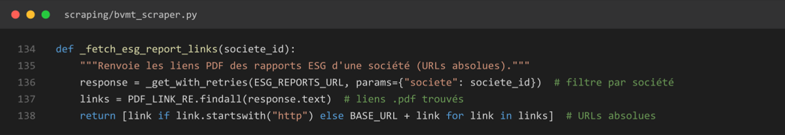

### → `_report_year()`

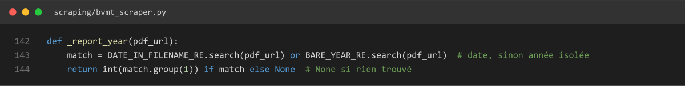

**Utilité** : contrairement à FTUSA, le nom de fichier BVMT contient presque toujours une date exploitable.

## Volet 3 — `sync_market_data()`

**Rôle dans le trajet** : réutilise `_matched_insurance_companies()`, `save_document()` et `save_kpi_value()` — le seul volet à combiner 2 destinations (profil société + bulletin sectoriel).

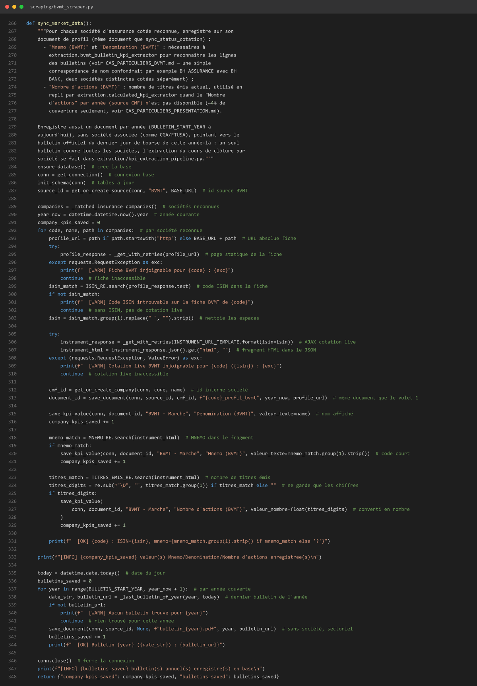

### → `_bulletin_links_in_range()`

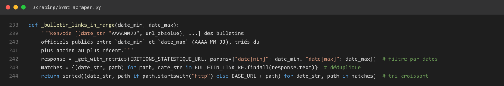

### → `_last_bulletin_of_year()`

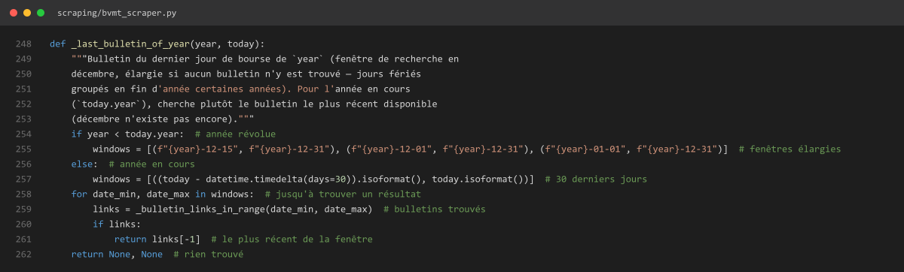

**Utilité** : fenêtre de recherche élargie si aucun bulletin trouvé en décembre (jours fériés groupés certaines années).

---

# Trajet de la donnée — Actualités (IlBoursa & Atlas Magazine)

**Cas particulier** : ces 2 sources partagent le même fichier (`api/routes/veille.py`) et les mêmes outils. Autre particularité : la destination finale n'est **pas** la table `documents` mais `actualites_vues` — une simple détection de nouveauté pour la cloche de notification, pas un stockage complet comme les 6 autres sources.

```
sync_new_items()                  -> point d'entrée réel (appelé par le pipeline)
   ├─ _scrape_ilboursa()            -> 7 tickers cotés BVMT
   │     ├─ _get()
   │     ├─ _article_image()
   │     ├─ _normalize_date()
   │     └─ _categorize()
   ├─ _scrape_atlas()               -> réutilise les 4 fonctions ci-dessus
   └─ diff_and_mark_actualites()    -> ★ FIN DU TRAJET (table actualites_vues)
```

## Étape 1 — `sync_new_items()`

**Rôle dans le trajet** : appelée uniquement par le pipeline planifié — jamais par une route HTTP live (`/api/actualites` reste un scrape à cache 1h, inchangé).

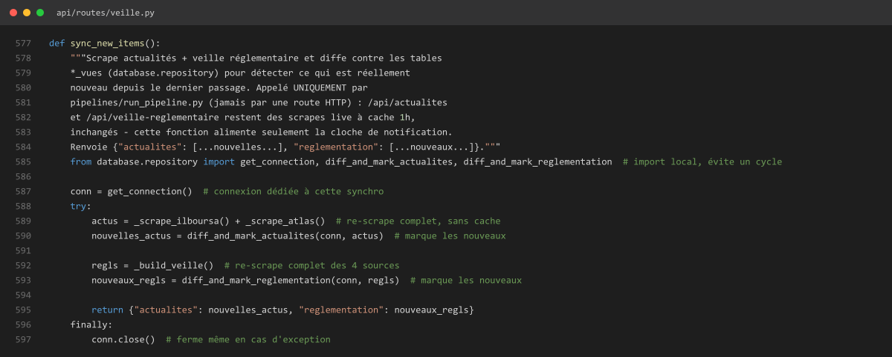

**Utilité** : vrai point d'entrée du trajet — scrape IlBoursa + Atlas, puis diffe contre la base.

## Étape 2 — `_scrape_ilboursa()`

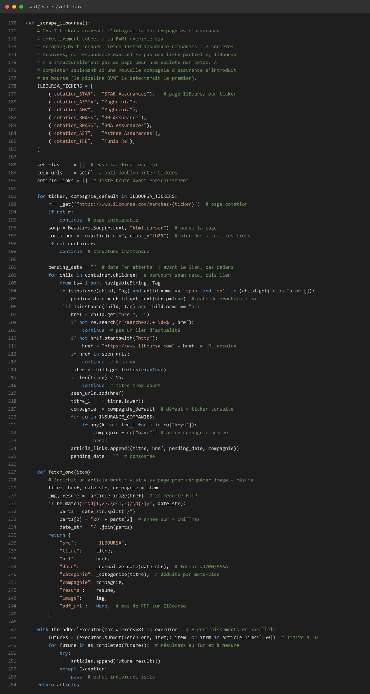

**Utilité** : couvre les 7 tickers cotés BVMT (liste vérifiée contre `bvmt_scraper._fetch_listed_insurance_companies`, pas une liste partielle).

## Étape 3 — `_get()`

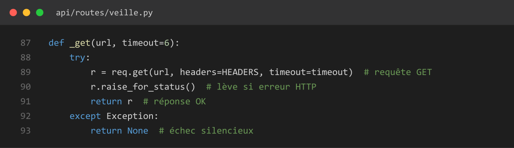

**Utilité** : requête HTTP simple, échec silencieux (renvoie `None`) — partagée par IlBoursa et Atlas Magazine.

## Étape 4 — `_article_image()`

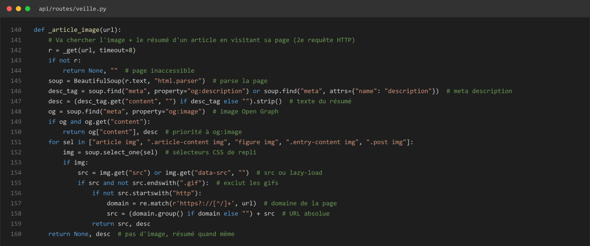

**Utilité** : va chercher l'image + le résumé d'un article en visitant sa page (2e requête HTTP).

## Étape 5 — `_normalize_date()`

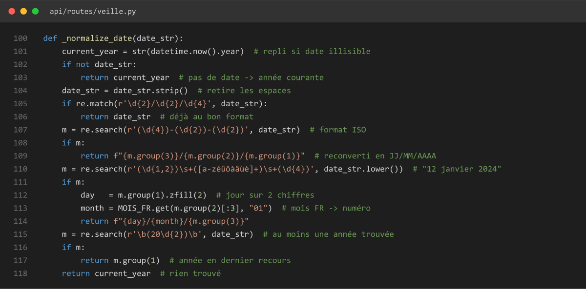

**Utilité** : normalise une date de publication au format JJ/MM/AAAA, quel que soit son format d'origine.

## Étape 6 — `_categorize()`

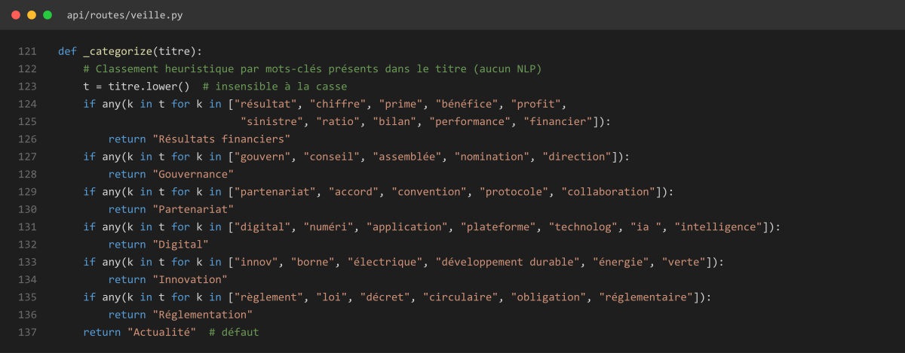

**Utilité** : classement heuristique par mots-clés présents dans le titre (aucun NLP).

## Étape 7 — `_scrape_atlas()`

**Rôle dans le trajet** : réutilise `_get()`, `_article_image()`, `_normalize_date()` et `_categorize()` vus ci-dessus.

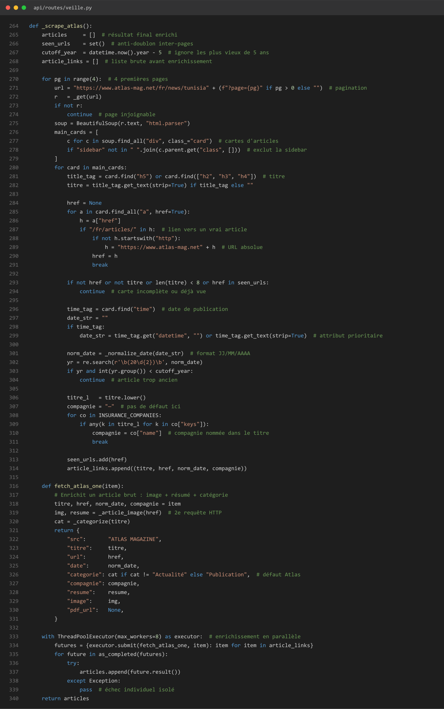

## Étape 8 — `diff_and_mark_actualites()` — ★ fin du trajet

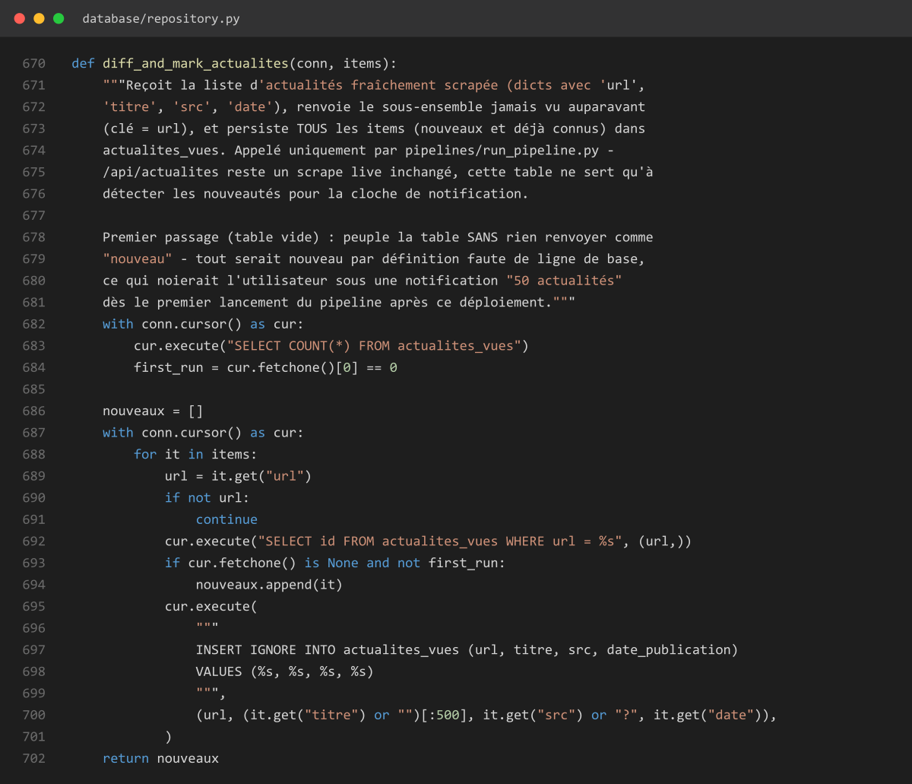

**Utilité** : au premier passage (table vide), peuple la table sans rien renvoyer comme « nouveau » — évite une avalanche de notifications au premier déploiement.

---

*Fin du trajet pour les 8 sources de scraping (jusqu'au stockage, avant extraction). Version interactive avec code complet cliquable : [Trajet CMF — artefact](https://claude.ai/code/artifact/52f949f2-aee8-49d8-8a1a-af7cb16cfa7b).*
